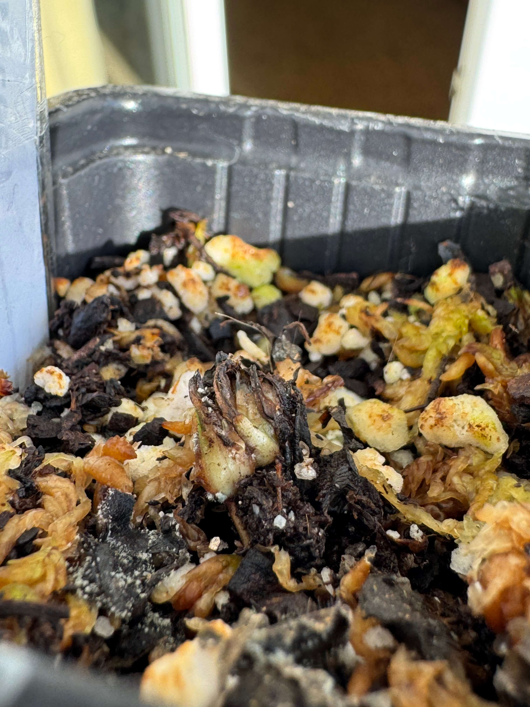
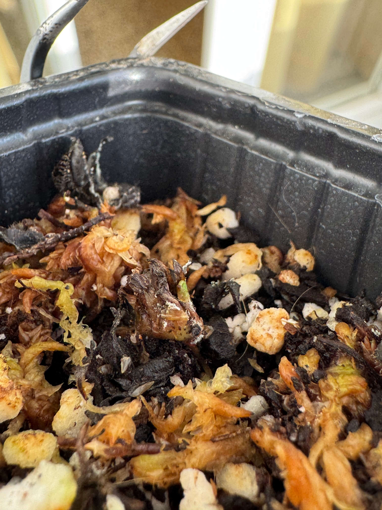

# 1st of December 2024

I'm BACK!

News from all the days that I didn't update:

- One small Sarracenia died. It didn't survived the dormancy period.
- One small Venus died too. It was my first Venus, yes, the one that I put it in my terrarium :c
- I got new Nepenthes, the Nepenthes Gaya. It's a beautiful plant.

Still busy studying for the exams and finishing all the projects do I have to deliver. I will do a update for the inventory soon

Also I need help with one of my Venus, it started becoming dark and brown from the rhizome and I don't know how to fix it. Maybe it is because the quantity of water that I'm giving to it.

*Venus rhizome*

    

## Weather

Sunny day  11ºC - 19ºC

## Final Inventory

| Code  |  Species                           | Size  |  Qty  |
| :---- | :--------------------------------- | :--: | :---: |
| V1/1  |  ~~Dionaea Muscipula Microdent~~       | M    |   1   |
| V1/2  |  Dionaea Muscipula B52             | M    |   6   |
| V1/3  |  Dionaea Muscipula Cupped Trap     | S    |   1   |
| V1/4  |  Dionaea Muscipula Amteborous      | S    |   1   |
| V1/5  |  Dionaea Muscipula Tritón          | S    |   1   |
| V1/6  |  Dionaea Muscipula Regular         | M    |   2   |
| V1/6  |  Dionaea Muscipula Regular         | S    |   1   |
| D1/1  |  Drosera Capensis Alba             | M    |   1   |
| D4/3  |  Drosera Aliciae Regular           | M    |   3   |
| N4/4  |  Nepenthes Hookeriana Regular      | M    |   2   |
| N7/7  |  Nepenthes Diana Regular           | L    |   2   |
| S1/1  |  Sarracenia Purpurea Venosa        | M    |   1   |
| S5/5  |  Sarracenia Stenvensii Regular     | M    |   3   |
| S5/5  |  ~~Sarracenia Stenvensii Regular~~     | S    |   1   |
| S6/6  |  Sarracenia Tygo Regular           | L    |   2   |

 
 
 
 
 

**Previous page**: <a href="../november/24_nov_2024">24 Nov 2024</a>

**Next page**: <a href="./2_dec_2024">2 Dec 2024</a>
 
 
 
 
 
 