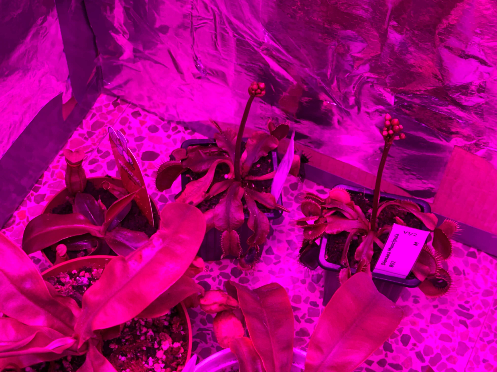

# 2nd of December 2024

Very good news for all. Do you remember the two venus that they were flowering? Well, they are still flowering! I'm so happy for them and they are very healthy. They are right with the Nepenthes in the greenhouse.

All other plants that need dormancy are outdoor

*Venus flowering*

    

## Weather

Sunny day  10ºC - 19ºC

## Final Inventory

| Code  |  Species                           | Size  |  Qty  |
| :---- | :--------------------------------- | :--: | :---: |
| ~~V1/1~~  |  ~~Dionaea Muscipula Microdent~~       | ~~M~~    |   ~~1~~   |
| V1/2  |  Dionaea Muscipula B52             | M    |   6   |
| V1/3  |  Dionaea Muscipula Cupped Trap     | S    |   1   |
| V1/4  |  Dionaea Muscipula Amteborous      | S    |   1   |
| V1/5  |  Dionaea Muscipula Tritón          | S    |   1   |
| V1/6  |  Dionaea Muscipula Regular         | M    |   2   |
| V1/6  |  Dionaea Muscipula Regular         | S    |   1   |
| D1/1  |  Drosera Capensis Alba             | M    |   1   |
| D4/3  |  Drosera Aliciae Regular           | M    |   3   |
| N4/4  |  Nepenthes Hookeriana Regular      | M    |   2   |
| N7/7  |  Nepenthes Diana Regular           | L    |   2   |
| S1/1  |  Sarracenia Purpurea Venosa        | M    |   1   |
| S5/5  |  Sarracenia Stenvensii Regular     | M    |   3   |
| ~~S5/5~~  |  ~~Sarracenia Stenvensii Regular~~     | ~~S~~    |   ~~1~~   |
| S6/6  |  Sarracenia Tygo Regular           | L    |   2   |

 
 
 
 
 

**Previous page**: <a href="./1_dec_2024">1 Dec 2024</a>

**Next page**: <a href="./3_dec_2024">3 Dec 2024</a>
 
 
 
 
 
 