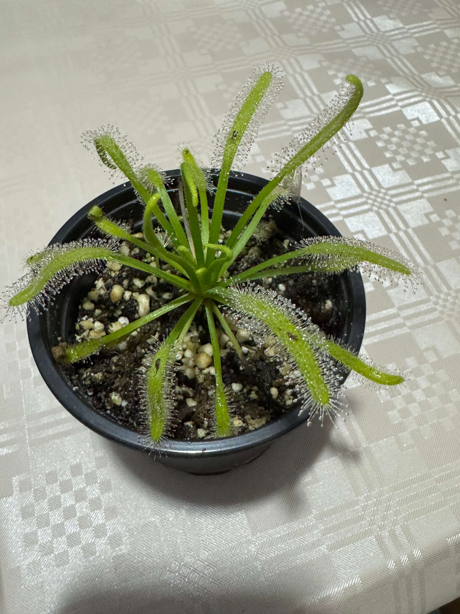
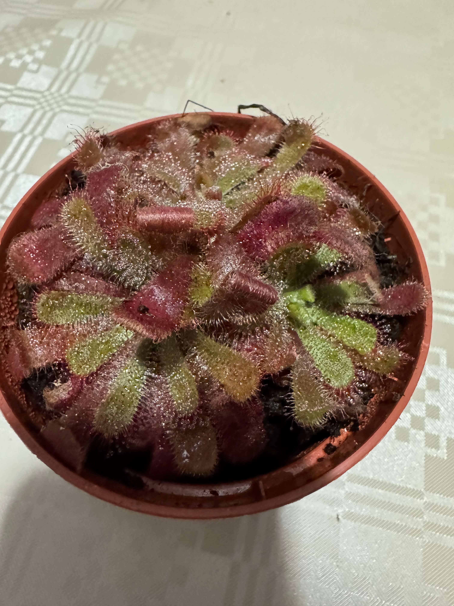

# 4th of December 2024

Today rained and I let the plants outside, they needed it. I tried to fix the humidity in the greenhouse, but it was difficult. I have to find a way to keep the humidity high without using humidifiers all the time. 

My drosera alba is growing a lot and I think I will have to transplant it soon. And also I want to split all the Nepenthes and cut the small pitchers to make them grow faster, or maybe I can cut it and make it grow by rhizomes.

And I have to split my drosera aliciae into three pots, they are growing a lot and they don't have enough space.

*Drosera Alba*

    

*Drosera Aliciae*
    
  

## Weather

Rainy day  8ºC - 18ºC

## Final Inventory

| Code  |  Species                           | Size  |  Qty  |
| :---- | :--------------------------------- | :--: | :---: |
| ~~V1/1~~  |  ~~Dionaea Muscipula Microdent~~       | ~~M~~    |   ~~1~~   |
| V1/2  |  Dionaea Muscipula B52             | M    |   6   |
| V1/3  |  Dionaea Muscipula Cupped Trap     | S    |   1   |
| V1/4  |  Dionaea Muscipula Amteborous      | S    |   1   |
| V1/5  |  Dionaea Muscipula Tritón          | S    |   1   |
| V1/6  |  Dionaea Muscipula Regular         | M    |   2   |
| V1/6  |  Dionaea Muscipula Regular         | S    |   1   |
| D1/1  |  Drosera Capensis Alba             | M    |   1   |
| D4/3  |  Drosera Aliciae Regular           | M    |   3   |
| N4/4  |  Nepenthes Hookeriana Regular      | M    |   2   |
| N7/7  |  Nepenthes Diana Regular           | L    |   2   |
| S1/1  |  Sarracenia Purpurea Venosa        | M    |   1   |
| S5/5  |  Sarracenia Stenvensii Regular     | M    |   3   |
| ~~S5/5~~  |  ~~Sarracenia Stenvensii Regular~~     | ~~S~~    |   ~~1~~   |
| S6/6  |  Sarracenia Tygo Regular           | L    |   2   |

 
 
 
 
 

**Previous page**: <a href="./3_dec_2024">3 Dec 2024</a>

**Next page**: <a href="./5_dec_2024">5 Dec 2024</a>
 
 
 
 
 
 