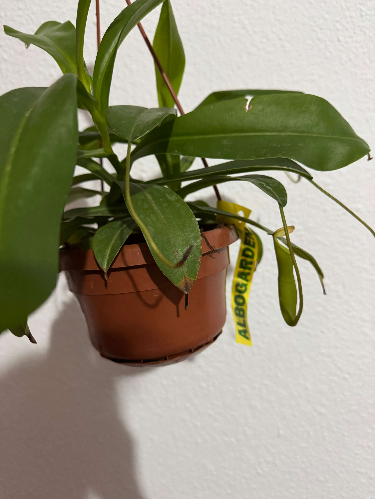
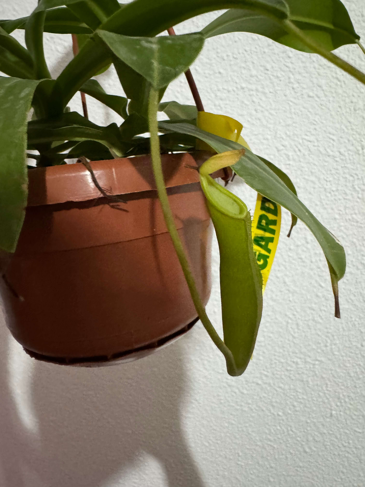
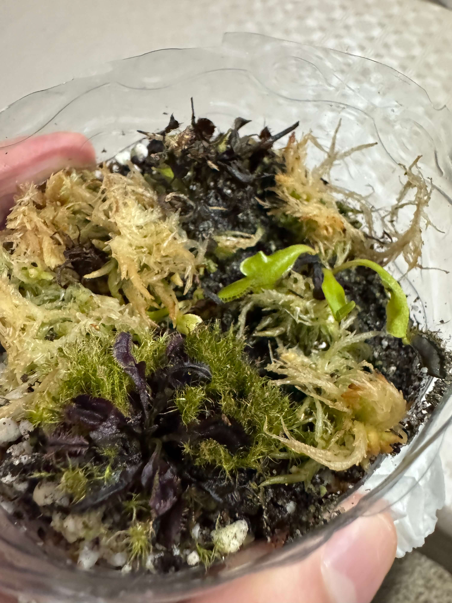

# 11st of November 2024

Bad weather is coming again, three days of intense rain are expected. I prepared all to recollect the water and let the plants to feel the temperature drop. And temperature will drop below 10ºC, perfect for dormancy.

This is the Nepenthes Diana. They have two small Jars.

*Nepenthes Diana*
    

*Nepenthes Diana*
    

Also, I am afraid of all of my small Venus that I have. Triton, Amteborous and Cupped Trap; because they started drying today and I don't know why. Maybe it's because the dormancy period, but I don't have enough experience to know if it's normal or not.

*Dionaeas*
    
  

## Weather

Partial Sunny  day 11ºC - 21ºC

## Final Inventory

(Plants)
- Dionaea Muscipula (Microdent)
- Sarracenia Bekerplant
- Dionaea Muscipula (B52)
- Nepenthes xHookeariana x2
- Drosera Capensi Alba
- Drosera Aliciae
- Sarracenia Stenvesii x 3
- Sarracenia Stevensii Mini
- Sarracenia Tygo
- Dionaea Muscipula (Cupped Trap)
- Dionaea Muscipula (Amteborous)
- Dionaea Muscipula (Tritón) x2
- Dionaea Muscipula (...)
- Sarracenia Purpurea Venosa
- Dionaea Muscipula Small
- Nepenthes Diana

(Seeds)
- Drosera ...

(Equipment)
- Full-Spectrum Light 50W

(Died)
- Drosera ...

 
 
 
 
 

**Previous page**: <a href="./10_nov_2024">10 Nov 2024</a>

**Next page**: <a href="./12_nov_2024">12 Nov 2024</a>
 
 
 
 
 
 