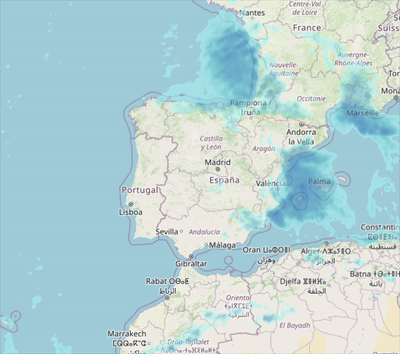

# 12th of November 2024

Amazing that we have reached 6 degrees of temperature in November, actually it's 11 but with the wind and all stuffs the temperature feels like 6. Today it din't rain as expected in the weather forecast, but tomorrow 100% will rain. And I received a warning about the wind, it will be strong. And also will rain a lot due to new DANA. Like the another one that we had in the past. The difference is that this one all the people will be more prepared.

*Weather Forecast*
    

## Weather

Partial Sunny  day 11ºC - 19ºC

## Final Inventory

(Plants)
- Dionaea Muscipula (Microdent)
- Sarracenia Bekerplant
- Dionaea Muscipula (B52)
- Nepenthes xHookeariana x2
- Drosera Capensi Alba
- Drosera Aliciae
- Sarracenia Stenvesii x 3
- Sarracenia Stevensii Mini
- Sarracenia Tygo
- Dionaea Muscipula (Cupped Trap)
- Dionaea Muscipula (Amteborous)
- Dionaea Muscipula (Tritón) x2
- Dionaea Muscipula (...)
- Sarracenia Purpurea Venosa
- Dionaea Muscipula Small
- Nepenthes Diana

(Seeds)
- Drosera ...

(Equipment)
- Full-Spectrum Light 50W

(Died)
- Drosera ...

 
 
 
 
 

**Previous page**: <a href="./11_nov_2024">11 Nov 2024</a>

**Next page**: <a href="./13_nov_2024">13 Nov 2024</a>
 
 
 
 
 
 