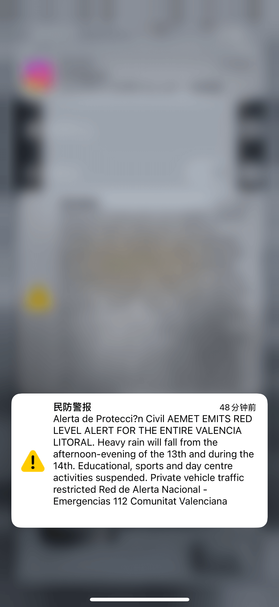

# 13th of November 2024

Finally today started raining and I received a warning from Civil Protection about high risk of flooding. Some places are alredy started flooding again, hope everything can be solved soon. Also the wind is very strong, I can hear the sound of the wind hitting the windows. I don't if the plants will resist to this wind. The temperatures are lower than yesterday.

Even thought I created an artificial envirnment with artificial temperature, the seeds of Drosera are not germinating. I think I will need to wait until the spring to see if they will germinate. 

*Civil Protection Alarm*
    
  

## Weather

Rainy day  day 11ºC - 16ºC

## Final Inventory

(Plants)
- Dionaea Muscipula (Microdent)
- Sarracenia Bekerplant
- Dionaea Muscipula (B52)
- Nepenthes xHookeariana x2
- Drosera Capensi Alba
- Drosera Aliciae
- Sarracenia Stenvesii x 3
- Sarracenia Stevensii Mini
- Sarracenia Tygo
- Dionaea Muscipula (Cupped Trap)
- Dionaea Muscipula (Amteborous)
- Dionaea Muscipula (Tritón) x2
- Dionaea Muscipula (...)
- Sarracenia Purpurea Venosa
- Dionaea Muscipula Small
- Nepenthes Diana

(Seeds)
- Drosera ...

(Equipment)
- Full-Spectrum Light 50W

(Died)
- Drosera ...

 
 
 
 
 

**Previous page**: <a href="./12_nov_2024">12 Nov 2024</a>

**Next page**: <a href="./14_nov_2024">14 Nov 2024</a>
 
 
 
 
 
 