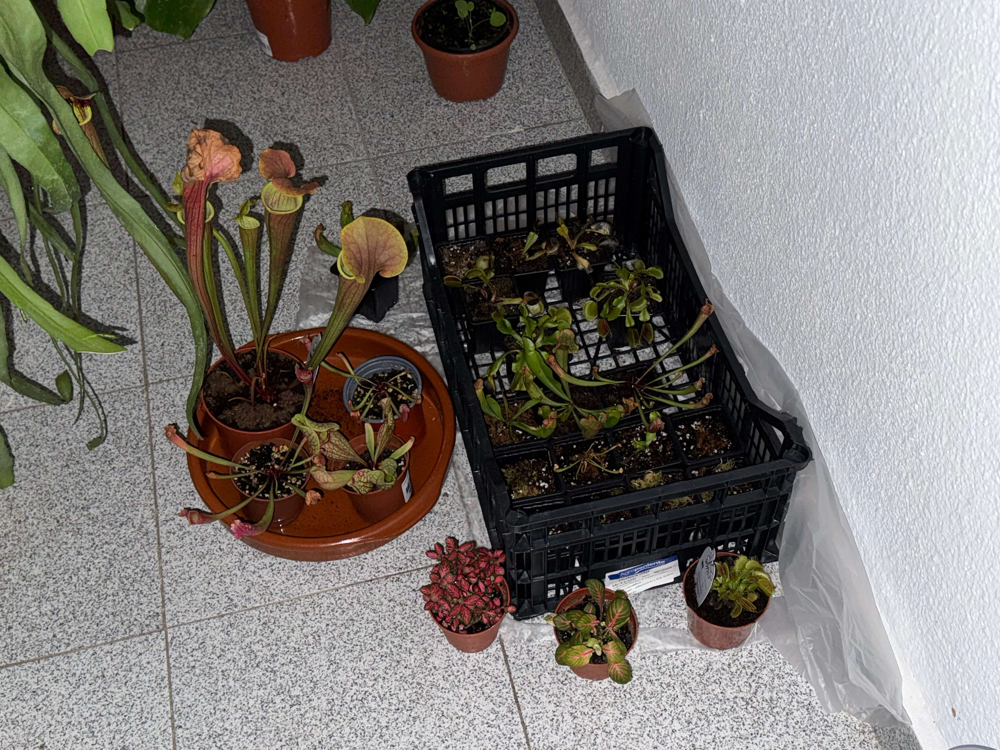

# 16th of November 2024

I finished the repotting, I also splitted some plants into smaller ones. And now it's better organized. I also removed MeatLand, I will use the tank to save the old soil and mix it with new soil to use in the future. 

My gf took some bugs for me to feed the plants, There where many caterpillars in different sizes, I choose different plants to feed them, but focused in the Sarracenia Tygo that have been weeks without food. In addition I feed the Dionaea Muscipula (Microdent) and the Sarracenia Stevensii Mini too.

*Repotting*
    
  

    
  

## Weather

Cloudy day 13ºC - 19ºC

## Final Inventory

(Plants)
- Dionaea Muscipula (Microdent)
- Sarracenia Bekerplant
- Dionaea Muscipula (B52)
- Nepenthes xHookeariana x2
- Drosera Capensi Alba
- Drosera Aliciae
- Sarracenia Stenvesii x 3
- Sarracenia Stevensii Mini
- Sarracenia Tygo
- Dionaea Muscipula (Cupped Trap)
- Dionaea Muscipula (Amteborous)
- Dionaea Muscipula (Tritón) x2
- Dionaea Muscipula (...)
- Sarracenia Purpurea Venosa
- Dionaea Muscipula Small
- Nepenthes Diana

(Seeds)
- Drosera ...

(Equipment)
- Full-Spectrum Light 50W

(Died)
- Drosera ...

 
 
 
 
 

**Previous page**: <a href="./15_nov_2024">15 Nov 2024</a>

**Next page**: <a href="./17_nov_2024">17 Nov 2024</a>
 
 
 
 
 
 