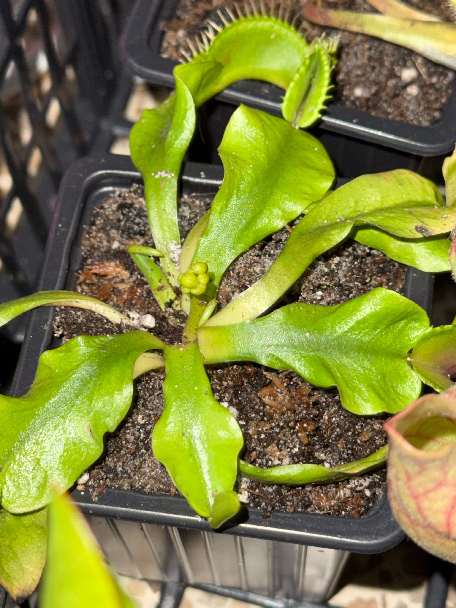
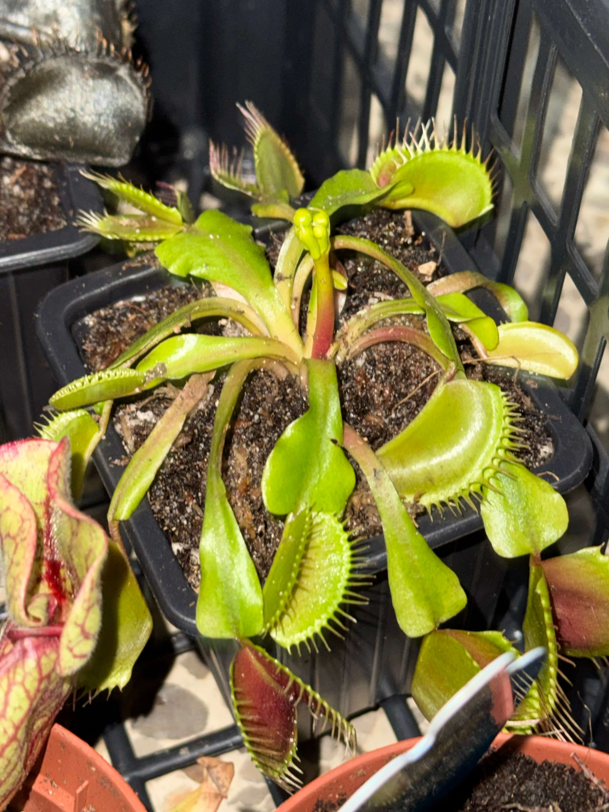

# 17th of November 2024

I found that two of my Venus has started flowering, before the winter. I'm afraid that the flowers will not be able to develop properly. And danger the base plant, I ask reddit for advice.

*Flowering*
    

Now I have new inventory to manage, I will update it tomorrow with all my new plants and seed (Most of them are from the same plant)
  

## Weather

Cloudy day 11ºC - 22ºC

## Final Inventory

(Plants)
- Dionaea Muscipula (Microdent)
- Sarracenia Bekerplant
- Dionaea Muscipula (B52)
- Nepenthes xHookeariana x2
- Drosera Capensi Alba
- Drosera Aliciae
- Sarracenia Stenvesii x 3
- Sarracenia Stevensii Mini
- Sarracenia Tygo
- Dionaea Muscipula (Cupped Trap)
- Dionaea Muscipula (Amteborous)
- Dionaea Muscipula (Tritón) x2
- Dionaea Muscipula (...)
- Sarracenia Purpurea Venosa
- Dionaea Muscipula Small
- Nepenthes Diana

(Seeds)
- Drosera ...

(Equipment)
- Full-Spectrum Light 50W

(Died)
- Drosera ...

 
 
 
 
 

**Previous page**: <a href="./16_nov_2024">16 Nov 2024</a>

**Next page**: <a href="./18_nov_2024">18 Nov 2024</a>
 
 
 
 
 
 