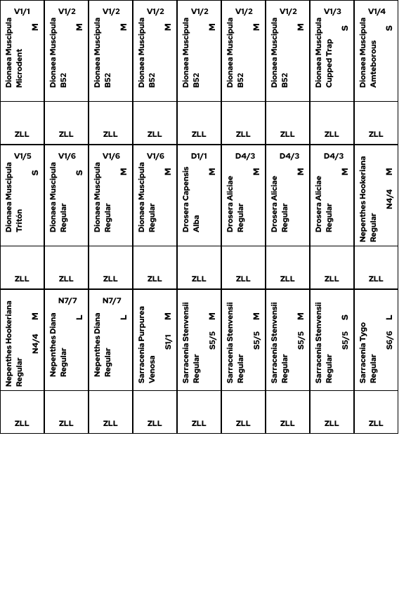
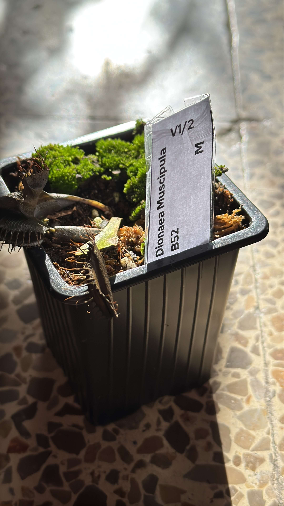
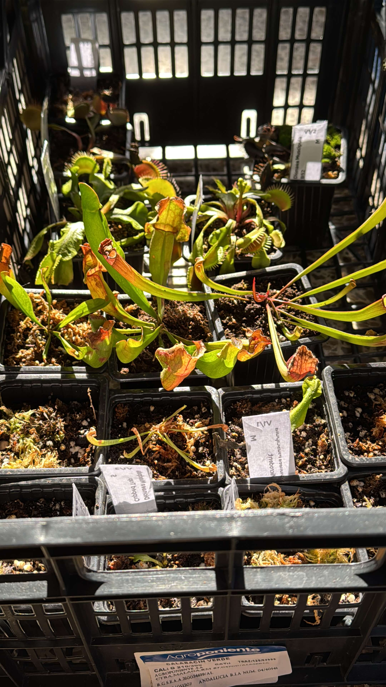
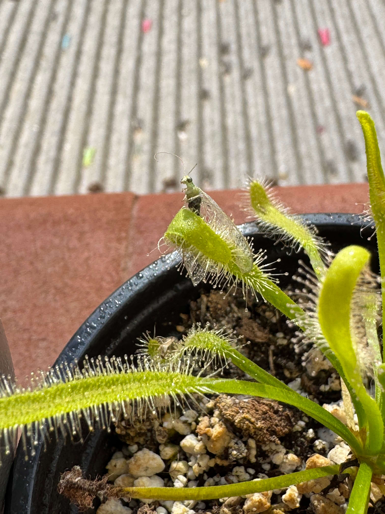

# 20th of November 2024

I created a design to print a id card for each plant and put it in the pot.

*Id Plants*
    

I have some pictures to update the status of my plants. 

*Dionaea Muscipula B52, Dionaea Muscipula Id, Drosera Capensi Alba*
    

I am thinking to create an account on any shop platform and start selling some of my plants, that'is why I created the database to manage my iventory easily. But I need more time to think about it, also all my plants are in dormancy condition so they are not in condition to be sold.

  

## Weather

Partial Sunny day 12ºC - 23ºC

## Final Inventory

| Code  |  Species                           | Size  |  Qty  |
| :---- | :--------------------------------- | :--: | :---: |
| V1/1  |  Dionaea Muscipula Microdent       | M    |   1   |
| V1/2  |  Dionaea Muscipula B52             | M    |   6   |
| V1/3  |  Dionaea Muscipula Cupped Trap     | S    |   1   |
| V1/4  |  Dionaea Muscipula Amteborous      | S    |   1   |
| V1/5  |  Dionaea Muscipula Tritón          | S    |   1   |
| V1/6  |  Dionaea Muscipula Regular         | M    |   2   |
| V1/6  |  Dionaea Muscipula Regular         | S    |   1   |
| D1/1  |  Drosera Capensis Alba             | M    |   1   |
| D4/3  |  Drosera Aliciae Regular           | M    |   3   |
| N4/4  |  Nepenthes Hookeriana Regular      | M    |   2   |
| N7/7  |  Nepenthes Diana Regular           | L    |   2   |
| S1/1  |  Sarracenia Purpurea Venosa        | M    |   1   |
| S5/5  |  Sarracenia Stenvensii Regular     | M    |   3   |
| S5/5  |  Sarracenia Stenvensii Regular     | S    |   1   |
| S6/6  |  Sarracenia Tygo Regular           | L    |   2   |

 
 
 
 
 

**Previous page**: <a href="./19_nov_2024">19 Nov 2024</a>

**Next page**: <a href="./21_nov_2024">21 Nov 2024</a>
 
 
 
 
 
 