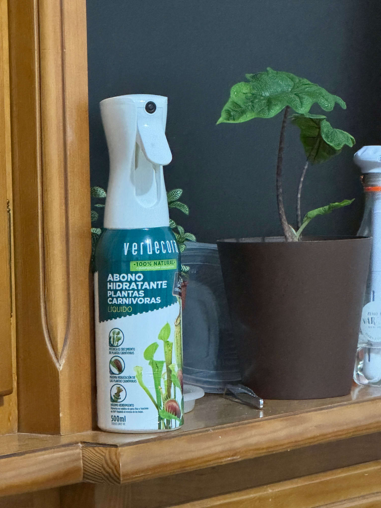

# 23th of November 2024

We are arriving december soon, and any care need it more attetion, only nepenthes and droseras will be needed to take care of. Also the two flowering dionaeas, today I fed them with some bugs (big bugs) to help them to finish the flowering process with more energy.

I bought a bottle of fertilizer for the plants, it is a bottle with nitrogen liquid to use it directly in the traps of the dionaeas and the pitchers of the nepenthes. And I using it in the droseras too.

*Fertilizer bottle*
    
  

## Weather

Sunny day / No sun day 14ºC - 19ºC

## Final Inventory

| Code  |  Species                           | Size  |  Qty  |
| :---- | :--------------------------------- | :--: | :---: |
| V1/1  |  Dionaea Muscipula Microdent       | M    |   1   |
| V1/2  |  Dionaea Muscipula B52             | M    |   6   |
| V1/3  |  Dionaea Muscipula Cupped Trap     | S    |   1   |
| V1/4  |  Dionaea Muscipula Amteborous      | S    |   1   |
| V1/5  |  Dionaea Muscipula Tritón          | S    |   1   |
| V1/6  |  Dionaea Muscipula Regular         | M    |   2   |
| V1/6  |  Dionaea Muscipula Regular         | S    |   1   |
| D1/1  |  Drosera Capensis Alba             | M    |   1   |
| D4/3  |  Drosera Aliciae Regular           | M    |   3   |
| N4/4  |  Nepenthes Hookeriana Regular      | M    |   2   |
| N7/7  |  Nepenthes Diana Regular           | L    |   2   |
| S1/1  |  Sarracenia Purpurea Venosa        | M    |   1   |
| S5/5  |  Sarracenia Stenvensii Regular     | M    |   3   |
| S5/5  |  Sarracenia Stenvensii Regular     | S    |   1   |
| S6/6  |  Sarracenia Tygo Regular           | L    |   2   |

 
 
 
 
 

**Previous page**: <a href="./22_nov_2024">22 Nov 2024</a>

**Next page**: <a href="./24_nov_2024">24 Nov 2024</a>
 
 
 
 
 
 