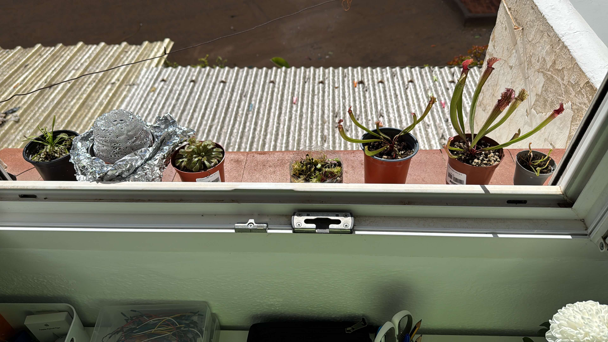

# 2nd of November 2024

I didn't go today to help, the government has closed the main roads to outside and the military has arrived to help. They told me that they have buses to send volunteers to help the people outside the city, but hearing the experiences from people that have gone, it is better to go by ourselves because the buses have been lost in the way and there are no more buses to go. 50 buses avaliable for 50 volunteers in each bus, that means only 2500 can go. And this morning they told me that more than 10000 people have gone to help and many of them didn't go due to the lack of buses.

The flood has taken 210 lives by now, and the number is incresing when the people take out the mud and water from houses and garages.

Returning to the plants diary, I putted my plants in the window to get some sun light because today is a sunny day, only 4 hours of sun, but it is better than nothing.

*Plants getting sun light.*
    

## Weather

Cloudy / Partial sunny day 17ºC - 21ºC

## Final Inventory

(Plants)
- Dionaea Muscipula (Microdent)
- Sarracenia Bekerplant
- Dionaea Muscipula (B52)
- Nepenthes Ventricosa X Alata x2
- Drosera Capensi Alba
- Drosera Aliciae
- Sarracenia Stenvesii x 3
- Sarracenia Stevensii Mini
- Sarracenia Tygo
- Dionaea Muscipula (Cupped Trap)
- Dionaea Muscipula (Amteborous)
- Dionaea Muscipula (Tritón) x2
- Dionaea Muscipula (...)

(Seeds)
- Drosera ...

(Equipment)
- Full-Spectrum Light 50W

(Died)
- Drosera ...

 
 
 
 
 

**Previous page**: <a href="./1_nov_2024">1 Nov 2024</a>

**Next page**: <a href="./2_nov_2024">2 Nov 2024</a>
 
 
 
 
 
 