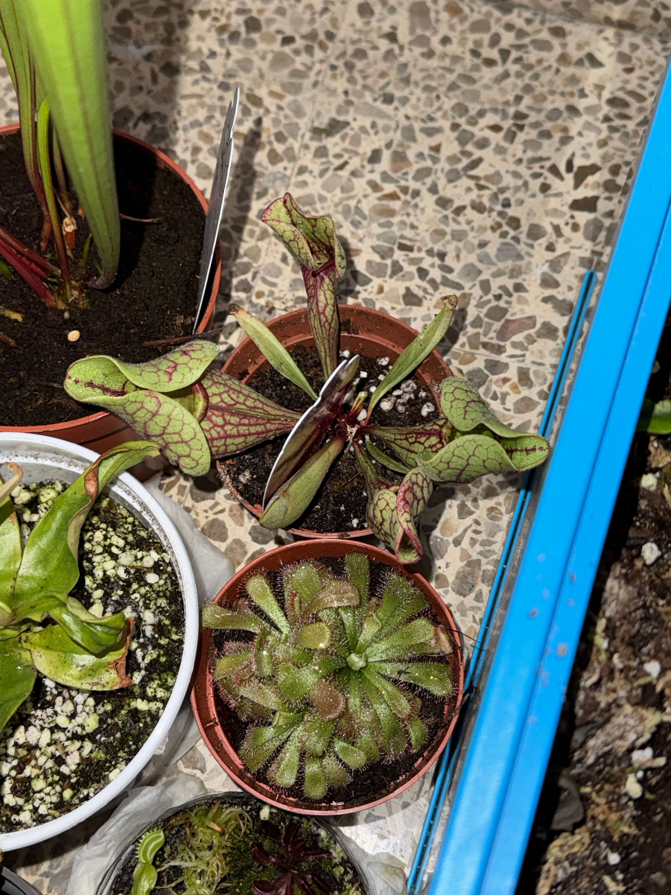
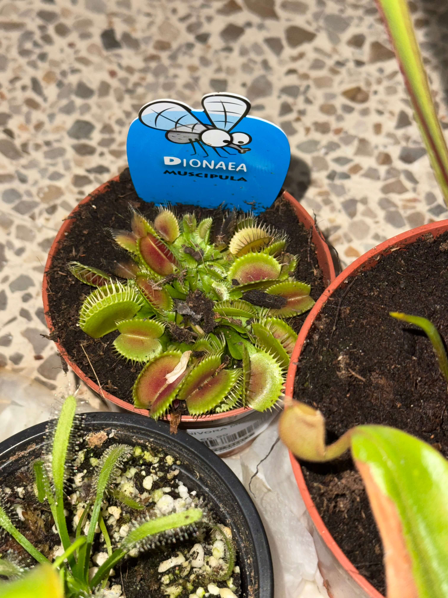

# 4th of November 2024

I have pictures of the Sarracenia Purpurea Venosa and the new Dionaea Muscipula that I bought yesterday.

*Sarracenia Purpurea Venosa.*
    

*Dionaea Muscipula.*
    

I have also cutted two leaves of the Drosera Capensi Alba to propagate them, I learned yesterday, it is quite easy. You only need to put the leaf in inside the still water and wait until the roots grow up. I will show you the progress in the next days.

## Weather

Cloudy / Rainy (Alert) day 16ºC - 22ºC

## Final Inventory

(Plants)
- Dionaea Muscipula (Microdent)
- Sarracenia Bekerplant
- Dionaea Muscipula (B52)
- Nepenthes xHookeariana x2
- Drosera Capensi Alba
- Drosera Aliciae
- Sarracenia Stenvesii x 3
- Sarracenia Stevensii Mini
- Sarracenia Tygo
- Dionaea Muscipula (Cupped Trap)
- Dionaea Muscipula (Amteborous)
- Dionaea Muscipula (Tritón) x2
- Dionaea Muscipula (...)
- Sarracenia Purpurea Venosa
- Dionaea Muscipula Small

(Seeds)
- Drosera ...

(Equipment)
- Full-Spectrum Light 50W

(Died)
- Drosera ...

 
 
 
 
 

**Previous page**: <a href="./3_nov_2024">3 Nov 2024</a>

**Next page**: <a href="./5_nov_2024">5 Nov 2024</a>
 
 
 
 
 
 