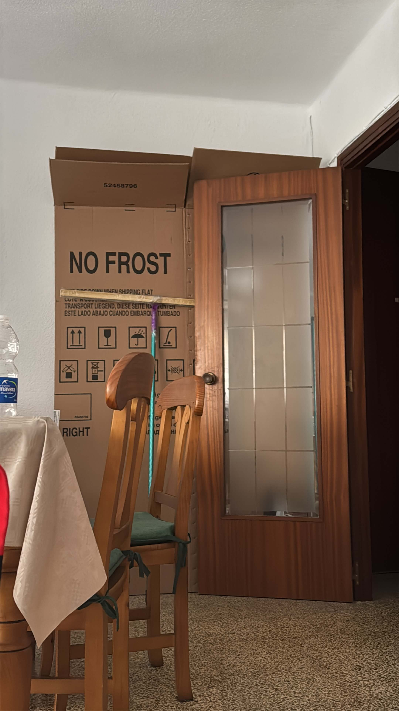
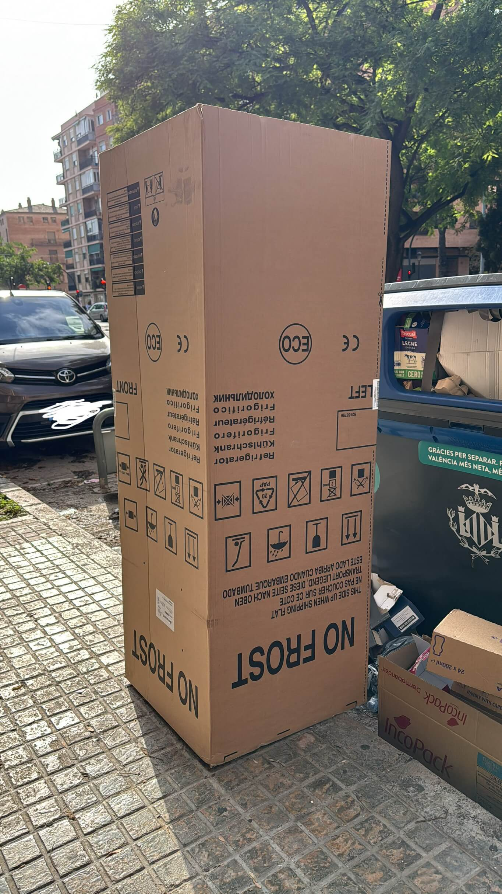

# 6th of November 2024

Guess what I found

I found a fridge envelope box, it is huge and large, perfect to create a new greenhouse and merge it with the old one. Actually I will destroy the old one, cause it is breaking and the top I think it cannot resist anymore the light. But my plan it is to create it during January or February.

*Fridge box*
    

## Weather

Cloudy / Partial Sunny  day 16ºC - 22ºC

## Final Inventory

(Plants)
- Dionaea Muscipula (Microdent)
- Sarracenia Bekerplant
- Dionaea Muscipula (B52)
- Nepenthes xHookeariana x2
- Drosera Capensi Alba
- Drosera Aliciae
- Sarracenia Stenvesii x 3
- Sarracenia Stevensii Mini
- Sarracenia Tygo
- Dionaea Muscipula (Cupped Trap)
- Dionaea Muscipula (Amteborous)
- Dionaea Muscipula (Tritón) x2
- Dionaea Muscipula (...)
- Sarracenia Purpurea Venosa
- Dionaea Muscipula Small

(Seeds)
- Drosera ...

(Equipment)
- Full-Spectrum Light 50W

(Died)
- Drosera ...

 
 
 
 
 

**Previous page**: <a href="./5_nov_2024">5 Nov 2024</a>

**Next page**: <a href="./7_nov_2024">7 Nov 2024</a>
 
 
 
 
 
 