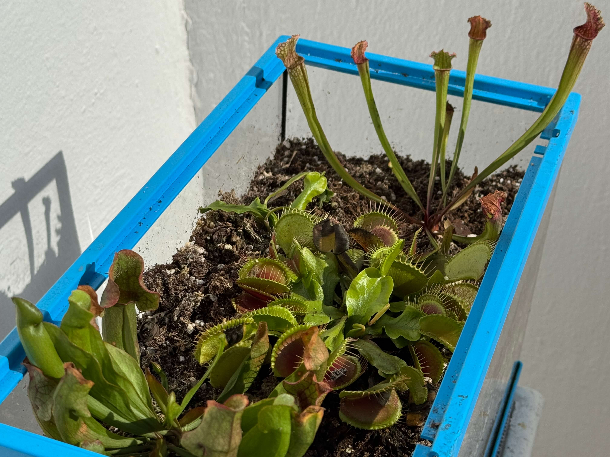
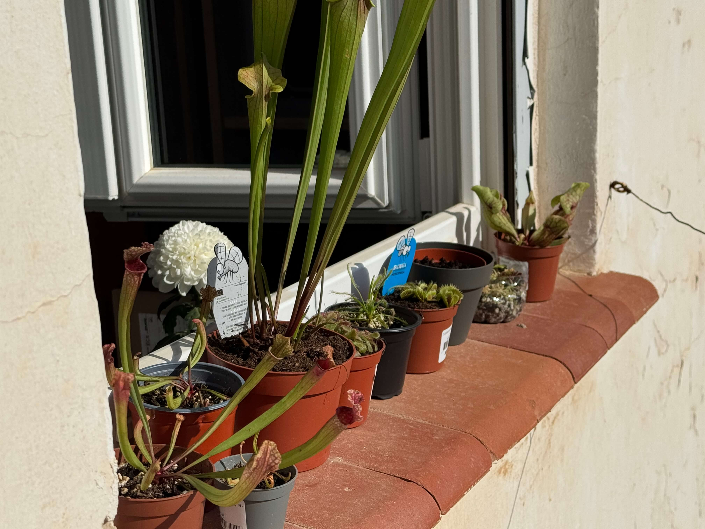

# 7th of November 2024

Very relaxing day, less and less sun light. I need to find a solution to catch more light for the plants. At the moment I am thinking to buy a full-spectrum light, but it is expensive and I'm not that kind of person who can afford it. (I am student 👉👈) I will appreciate any donation given.

No more to say today. Show you some pictures of the plants.

*Plants*
    

## Weather

Partial Sunny  day 15ºC - 22ºC

## Final Inventory

(Plants)
- Dionaea Muscipula (Microdent)
- Sarracenia Bekerplant
- Dionaea Muscipula (B52)
- Nepenthes xHookeariana x2
- Drosera Capensi Alba
- Drosera Aliciae
- Sarracenia Stenvesii x 3
- Sarracenia Stevensii Mini
- Sarracenia Tygo
- Dionaea Muscipula (Cupped Trap)
- Dionaea Muscipula (Amteborous)
- Dionaea Muscipula (Tritón) x2
- Dionaea Muscipula (...)
- Sarracenia Purpurea Venosa
- Dionaea Muscipula Small

(Seeds)
- Drosera ...

(Equipment)
- Full-Spectrum Light 50W

(Died)
- Drosera ...

 
 
 
 
 

**Previous page**: <a href="./6_nov_2024">6 Nov 2024</a>

**Next page**: <a href="./8_nov_2024">8 Nov 2024</a>
 
 
 
 
 
 