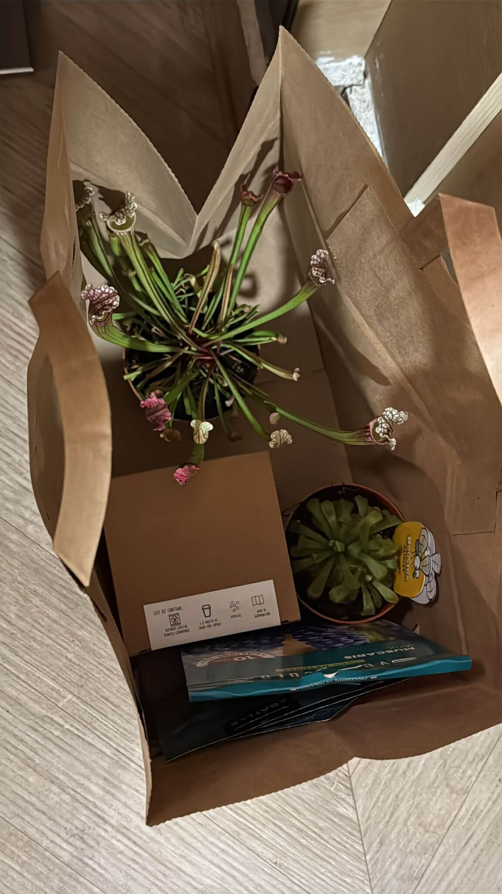
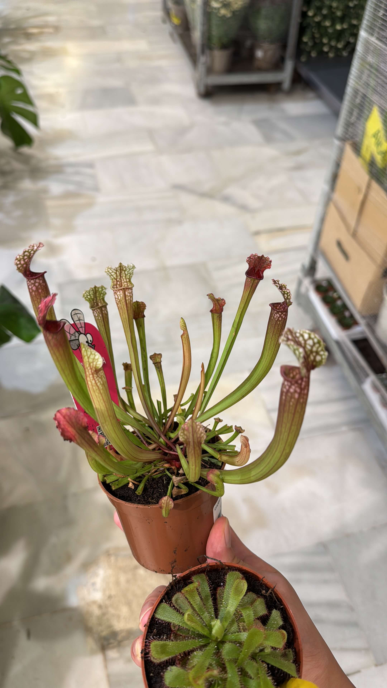
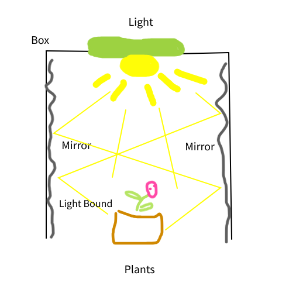

# 17th Of Octover 2024

Today I bought two new plants, a **Sarracenia Stevensii** and a **Drosera Aliciae** . Actually the pot of sarracenia has 2 sarracenias, a big one and a small one, and I'm thinking to transplant the small one to the fish tank, also I put a name to tank calling it "MeatLand" because today since it was a windy day many flies were pushed by the wind into our flat, so I was killing all because there was a lot, mainwhile I catched many flies to feed to my plants and I think they have enough food for almost three months. And that's why I decided to call my tank "MeatLand", because plant in my hand, plant with meat.

 

*New Drosera and Sarracenia.*
    

 

*New Drosera and Sarracenia.*
    
 

I need to create a small greenhouse with a box and some aluminium of solid mirrors, not regular to avoid burns in certain degrees of the light. I will do it tomorrow if I have time.

 

*Diagram of the Small DIY Greenhouse.*
    
 

## Final Inventory

- Dionaea Muscipula (Microdent)
- Sarracenia Bekerplant
- Dionaea Muscipula (B52)
- Nepenthes ...
- Drosera ...
- Drosera ...
- Drosera Aliciae
- Sarracenia Stenvesii
- Full-Spectrum Light 50W

 
 
 
 
 

**Previous page**: *null*

**Next page**: <a href="./18_oct_2024">18 Oct 2024</a>
 
 
 
 
 
 