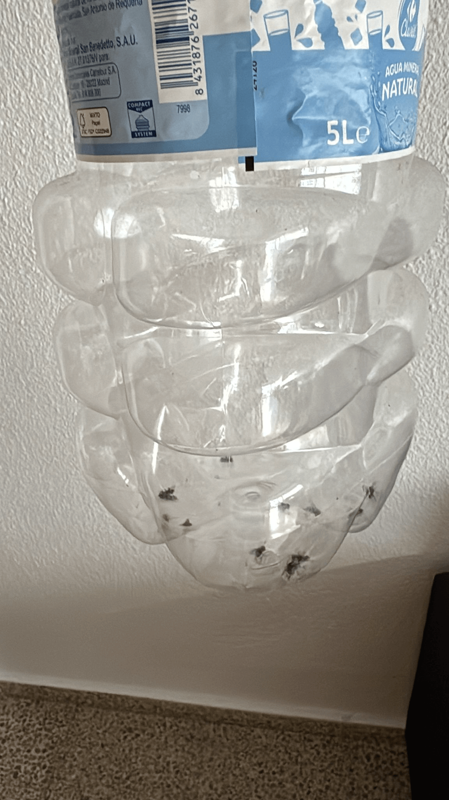
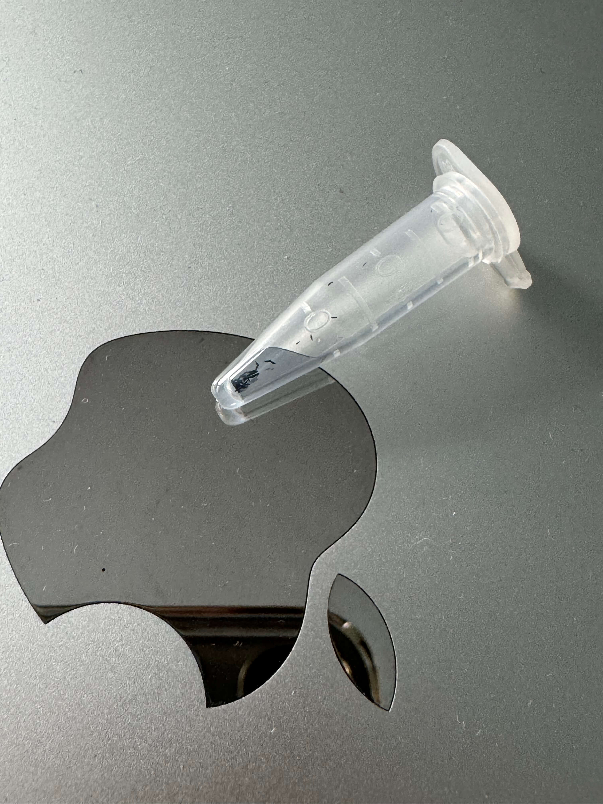
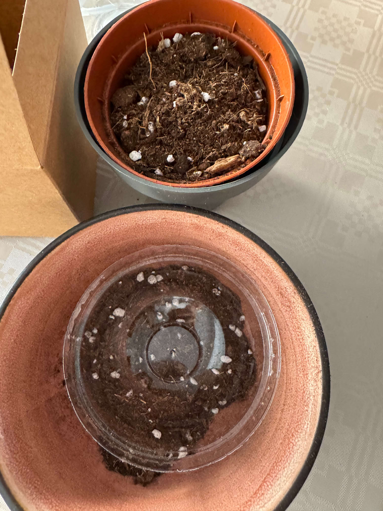

# 18th Of Octover 2024

Before telling you what I did today I'm going to show you all the flies I catched yesterday. There are like 20 flies in the bottle going to be food for my plants.

*Many Flies.*
    

I adquired some seeds of **Drosera** (I don't know the species, I'm sorry but I tried to search it but until it isn't have grown up I can't determine the species) and I'm going to plant them today before Winter comes. The temperate is the problem because it's autumn and the temperature is going down, so I need to simulate the range of 20ºC to 30ºC to make them grow up. Maybe using a heat mat or a heating pad, I don't know yet. The only thing I know is that I didn't find any box to do the greenhouse.

*Drosera Seeds.*
    

I'm going to plant them in a pot with a plastic bag on top to simulate the greenhouse effect, but I'm not sure if it's going to work. I need to find a box to do the greenhouse, I think it's going to be better.

*Drosera Pot and Greenhouse DIY.*
    
 

## Final Inventory

(Plants)
- Dionaea Muscipula (Microdent)
- Sarracenia Bekerplant
- Dionaea Muscipula (B52)
- Nepenthes ...
- Drosera ...
- Drosera ...
- Drosera Aliciae
- Sarracenia Stenvesii

(Seeds)
- Drosera ...

(Equipment)
- Full-Spectrum Light 50W

 
 
 
 
 

**Previous page**: <a href="./17_oct_2024.md">17 Oct 2024</a>

**Next page**: <a href="./19_oct_2024.md">19 Oct 2024</a>
 
 
 
 
 
 
