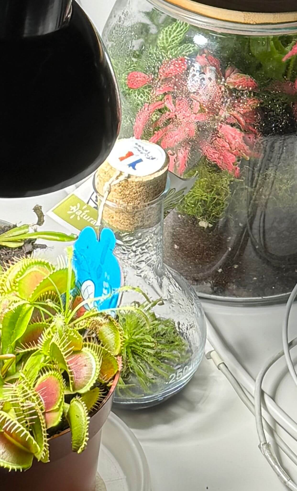
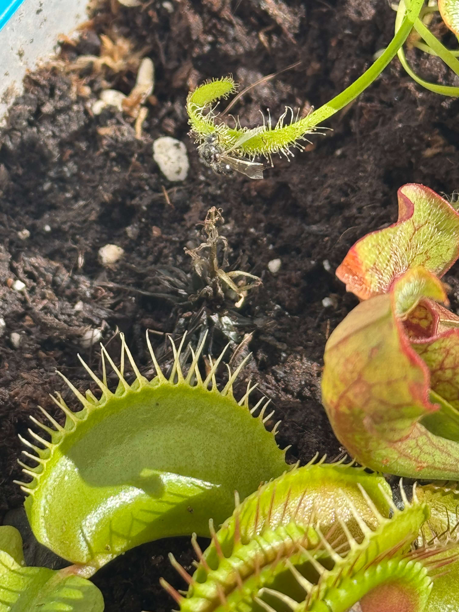
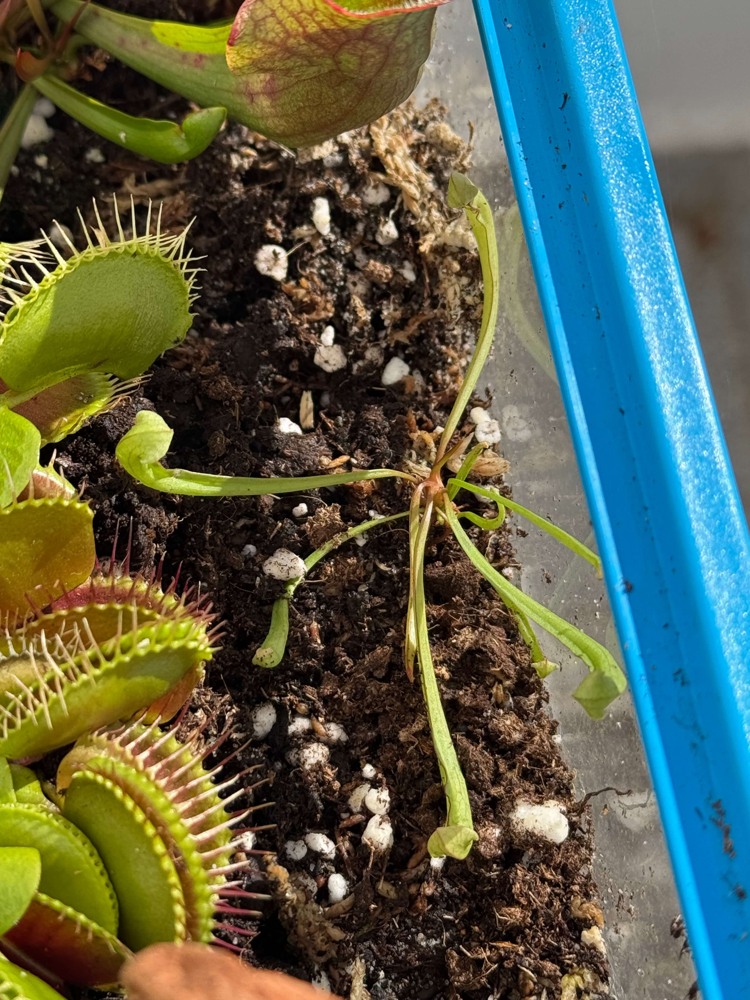
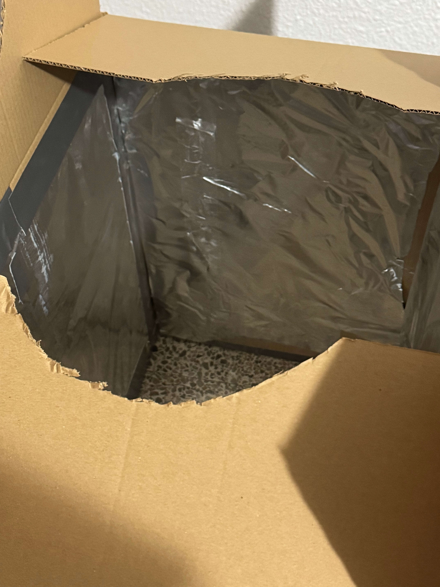
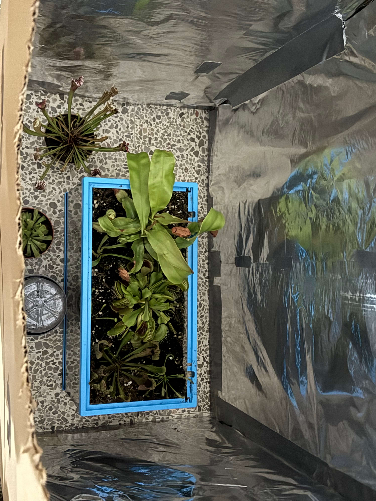
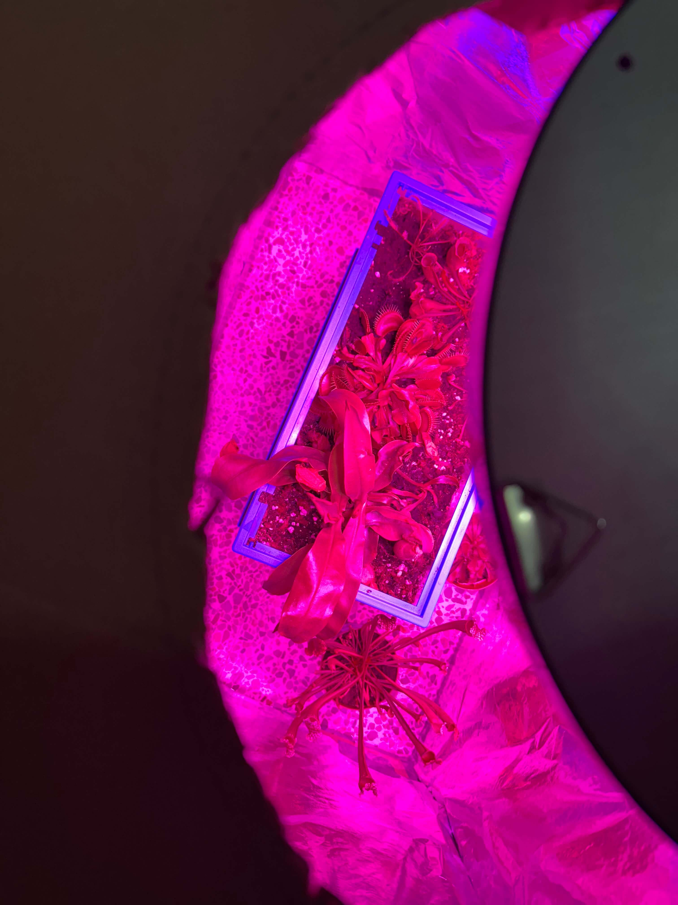
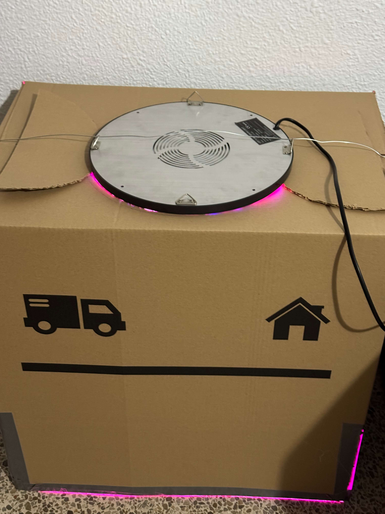
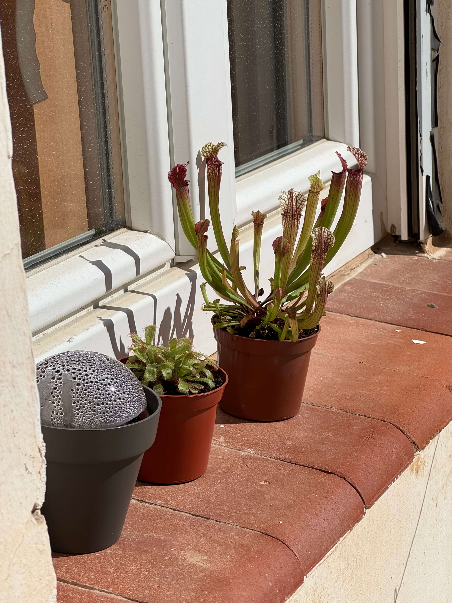
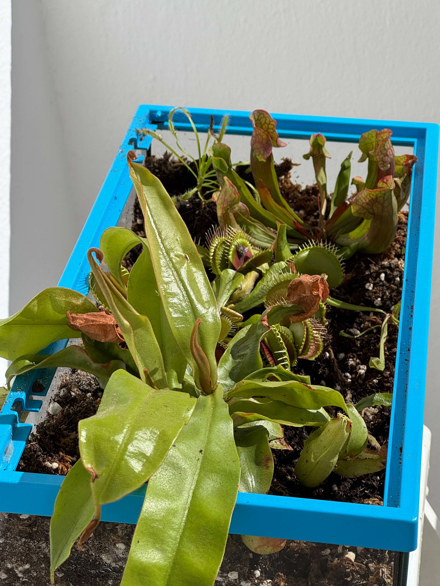

# 19th Of Octover 2024

Bad new, the smallest Drosera that I have, died. It become black and I don’t know why it’s happening that, maybe because the shock of environment cuz the plant before was inside a terrarium, but nosense, I followed all the steps that the laboratory recommended, I take it outside and I put it inside a glass bottle to simulate the same condition and I let it a couple of weeks and then I transplanted the drosera to my MeatLand. I have to say that the Drosera at the beginning was dying even inside the terrarium.

*Drosera inside the terrarium.*
    

*Drosera dying*
    

I found the species of the drosera seeds, maybe they are Capensis… or maybe they are some kind of hybrid. Also I found one small Sarracenia in the same pot of the Sarracenia Stevensii, and I transplanted it to the MeatLand, so now I have two Sarracenias in the tank. I think the small one is a Sarracenia Stevensii too so I will call it Sarracenia Stevensii Mini.

*Sarracenia Stenvensii Mini inside the MeatLand.*
    

And finally I created my DIY greenhouse with a box and some aluminium, not very beautiful but it works. I didn't find any box in any trash so I had to buy one. Now I can simulate the greenhouse effect easily, for now the temperature is good, but I need to find a way to simulate the humidity, maybe with a humidifier or a fogger, and also I have to simulate the winter temperature.

*DIY Greenhouse.*
    

*DIY Greenhouse closed.*
    

*DIY Greenhouse inside.*

*DIY Greenhouse outside.*
    
 

### Weather

Sunny Day, 13ºC. 26ºC.

*New collection*
    

*MeatLand under the sun*
    
 

## Final Inventory

(Plants)
- Dionaea Muscipula (Microdent)
- Sarracenia Bekerplant
- Dionaea Muscipula (B52)
- Nepenthes ...
- Drosera ...
- Drosera Aliciae
- Sarracenia Stenvesii
- Sarracenia Stevensii Mini

(Seeds)
- Drosera ...

(Equipment)
- Full-Spectrum Light 50W

(Died)
- Drosera ...

 
 
 
 
 

**Previous page**: <a href="./18_oct_2024">18 Oct 2024</a>

**Next page**: <a href="./20_oct_2024">20 Oct 2024</a>
 
 
 
 
 
 