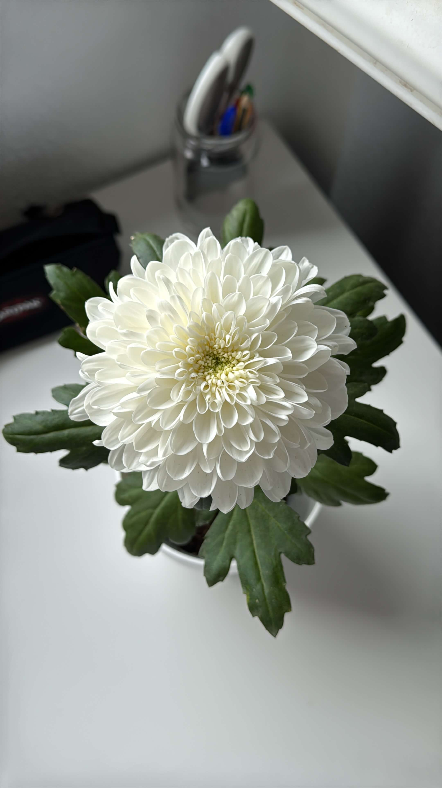
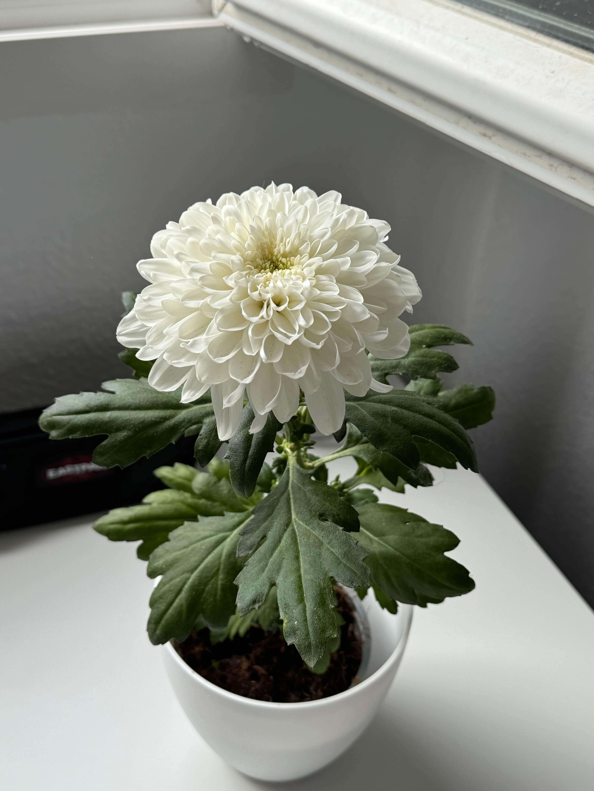

# 19th Of October 2024

Take a look this gorgeous flower.

*Big Flower.*
    

Today was cloudy, but the sun was shining. I took the plants outside to get some sun light. And I bought some still water for the plants, remaiding that I need to create a system to catch the rain water.

### Weather

Cloudy/Sunny Day, 15ºC. 26ºC.

## Final Inventory

(Plants)
- Dionaea Muscipula (Microdent)
- Sarracenia Bekerplant
- Dionaea Muscipula (B52)
- Nepenthes ...
- Drosera ...
- Drosera Aliciae
- Sarracenia Stenvesii
- Sarracenia Stevensii Mini

(Seeds)
- Drosera ...

(Equipment)
- Full-Spectrum Light 50W

(Died)
- Drosera ...

 
 
 
 
 

**Previous page**: <a href="./19_oct_2024">19 Oct 2024</a>

**Next page**: <a href="./21_oct_2024">21 Oct 2024</a>
 
 
 
 
 
 