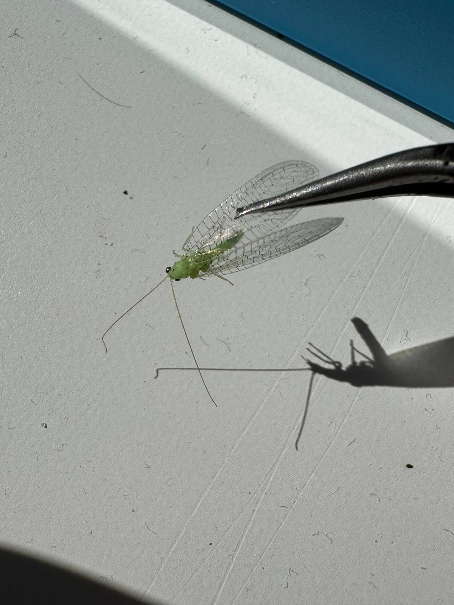
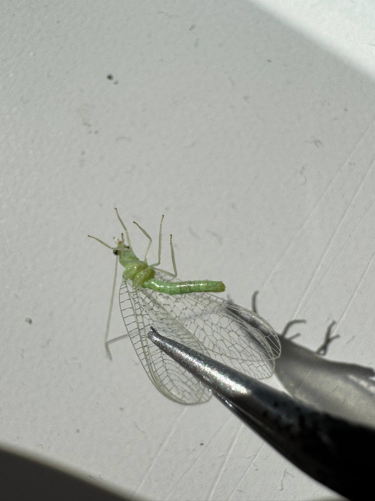
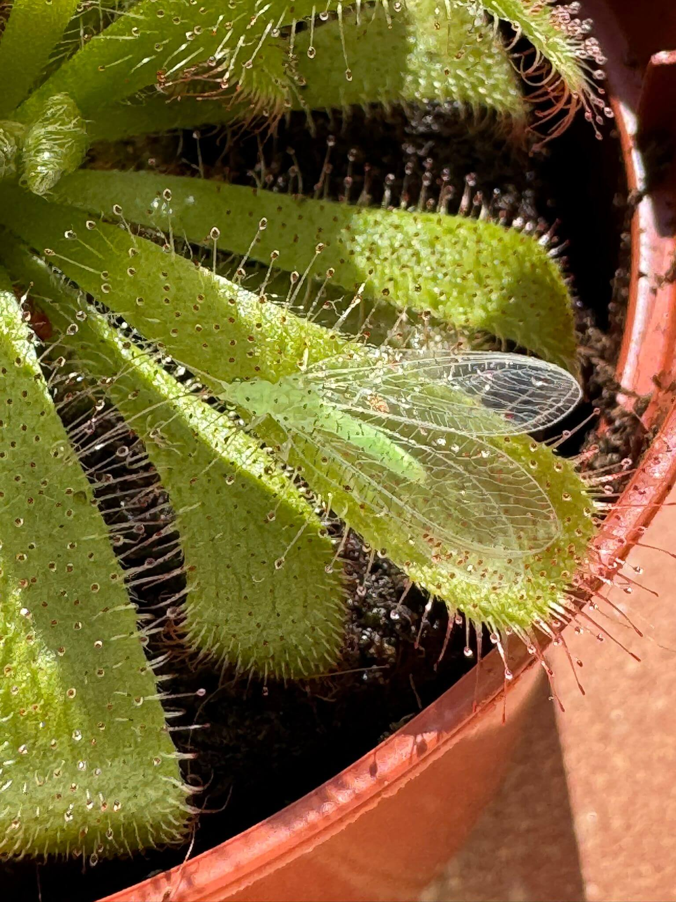

# 21th Of Octover 2024

Nothing to say today. I was focusing on the work and my exams so I did not pay a lot of attention on my plants. Althrough I hunted a beautiful bug to feed my drosera.

*Green bug.*
    

*Green bug being eaten.*
    

## Weather

Sunny day ☀️ 15ºC - 24ºC

## Final Inventory

(Plants)
- Dionaea Muscipula (Microdent)
- Sarracenia Bekerplant
- Dionaea Muscipula (B52)
- Nepenthes ...
- Drosera ...
- Drosera Aliciae
- Sarracenia Stenvesii
- Sarracenia Stevensii Mini

(Seeds)
- Drosera ...

(Equipment)
- Full-Spectrum Light 50W

(Died)
- Drosera ...

 
 
 
 
 

**Previous page**: <a href="./20_oct_2024">20 Oct 2024</a>

**Next page**: <a href="./22_oct_2024">22 Oct 2024</a>
 
 
 
 
 
 