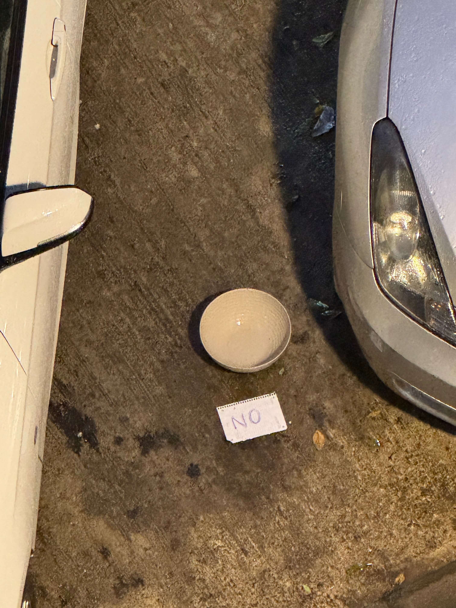
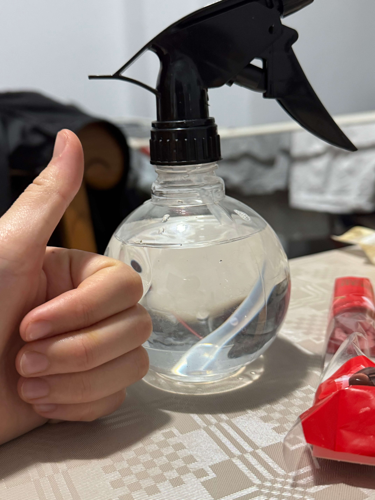

# 22nd Of October 2024

At 19:00 started raining so I took my girlfriend's bowl outside the street to collect some rainwater. But, only after 10 minutes, the rain stopped. I was able to collect a little bit of water. 

*Collecting water.*
    

Enough water to fill my flish flish bottle.

*Filling the bottle (Hand reference).*
    

I was afraid that someone will steal my girlfriend's bowl, and after looking the amount of water I collected, I decided to create a DIY rainwater collector. Not too big but enough to collect water for my plants.

*DIY rainwater collector.*
    

## Weather

Cloudy / Rainy (50%) day ☔︎ 16ºC - 24ºC

## Final Inventory

(Plants)
- Dionaea Muscipula (Microdent)
- Sarracenia Bekerplant
- Dionaea Muscipula (B52)
- Nepenthes ...
- Drosera ...
- Drosera Aliciae
- Sarracenia Stenvesii
- Sarracenia Stevensii Mini

(Seeds)
- Drosera ...

(Equipment)
- Full-Spectrum Light 50W

(Died)
- Drosera ...

 
 
 
 
 

**Previous page**: <a href="./21_oct_2024">21 Oct 2024</a>

**Next page**: <a href="./23_oct_2024">23 Oct 2024</a>
 
 
 
 
 
 