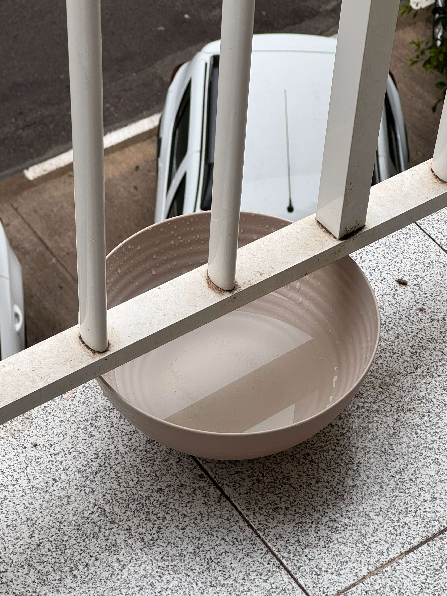
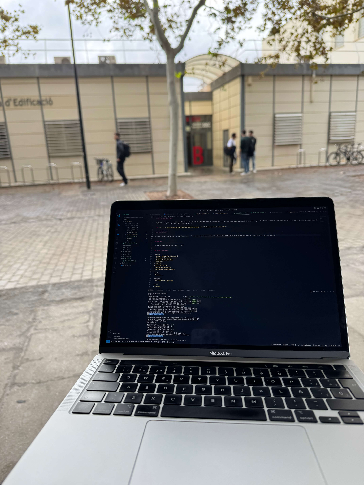

# 23th Of October 2024

It started raining at midnight, and before going to sleep I put the bowl in the balcony to see how many water can catch during the night. And for my surprise, the bowl was mid full of water, it is true that the water was a little bit dirty, but I can filter it.

*Collecting water.*
    

I didn't take a lot of care of my plants today, I was focused on my work and my exams. And I had a mini-exam at the university, not too difficult but awful.

*Writing diary.*
    
 

## Weather

Cloudy / Rainy (55%) day ☔︎ 16ºC - 21ºC

## Final Inventory

(Plants)
- Dionaea Muscipula (Microdent)
- Sarracenia Bekerplant
- Dionaea Muscipula (B52)
- Nepenthes ...
- Drosera ...
- Drosera Aliciae
- Sarracenia Stenvesii
- Sarracenia Stevensii Mini

(Seeds)
- Drosera ...

(Equipment)
- Full-Spectrum Light 50W

(Died)
- Drosera ...

 
 
 
 
 

**Previous page**: <a href="./22_oct_2024">22 Oct 2024</a>

**Next page**: <a href="./24_oct_2024">24 Oct 2024</a>
 
 
 
 
 
 