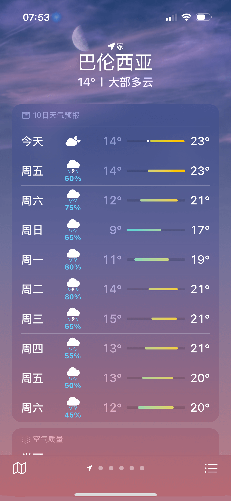
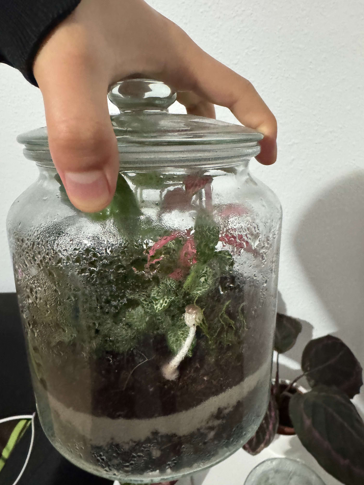
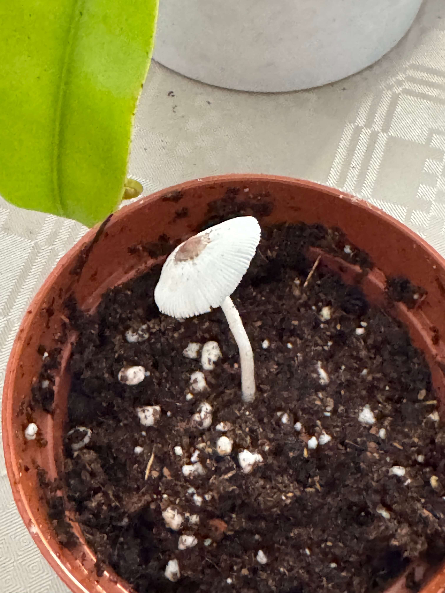

# 24th Of October 2024

Lot of thing to say today.

  
The weather is getting more and more colder so I think is time to put my plants in dormancy. And to avoid any damage to my nepenthes I'm going to take the nepenthes out the MeatLand, since it's a tropical plant it won't need to enter dormancy and still providing they light and temperature. Also, I identified the species of the big drosera in MeatLand, it is the Capensi Alba, and same as the Nepenthes it's a tropical plant, but for the drosera I will keep it in th MeatLand and control it daily to investigate what will happen. 

*Recent Weather.*
    

I'm not going to put the MeatLand at the fridge, but I will put them in a low temperature place with entire dark environment. The temperate range will be 10ºC to 12ºC to avoiding Capensi alba dying.

 
And finally, in addition of such great news, a mushroom has grown in one of my terrariums, I saw it this morning before going to work and after returning home the mushroom opened up and the spores were released. Hope it doesn't affect the plants in the terrarium.

*Mushroom in the terrarium.*
    

*Mushroom opened up.*
    
 

## Weather

Cloudy day 15ºC - 23ºC

## Final Inventory

(Plants)
- Dionaea Muscipula (Microdent)
- Sarracenia Bekerplant
- Dionaea Muscipula (B52)
- Nepenthes ...
- Drosera Capensi Alba
- Drosera Aliciae
- Sarracenia Stenvesii
- Sarracenia Stevensii Mini

(Seeds)
- Drosera ...

(Equipment)
- Full-Spectrum Light 50W

(Died)
- Drosera ...

 
 
 
 
 

**Previous page**: <a href="./23_oct_2024">23 Oct 2024</a>

**Next page**: <a href="./25_oct_2024">25 Oct 2024</a>
 
 
 
 
 
 