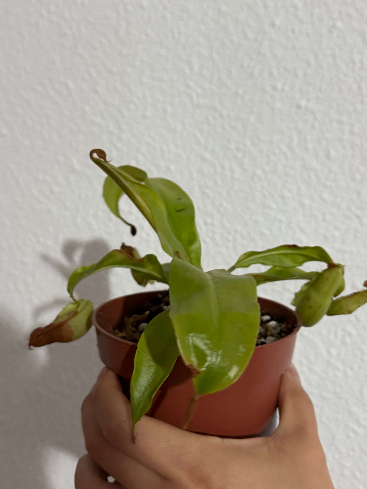
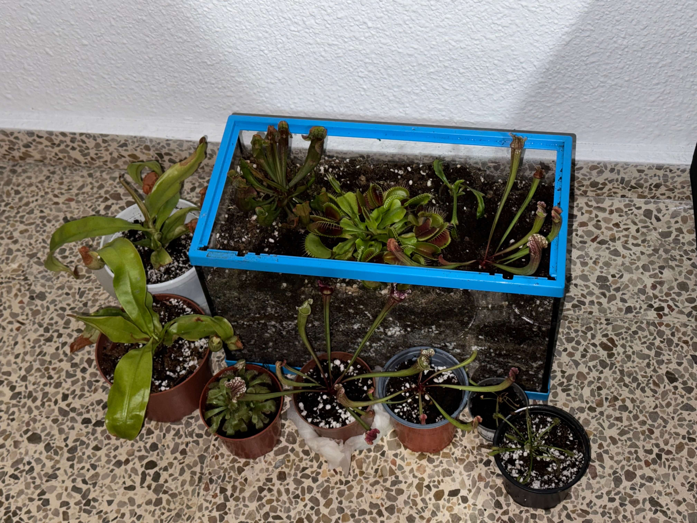
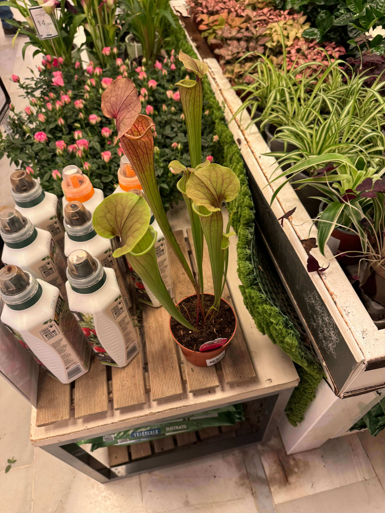

# 25th Of October 2024

I regret about what I said yesterday, I going to take the drosera out eitheir. And transplant all the plants, also when I was transplating the Sarracenia Stenvensii I realised that there was three Sarracenias in the same pot so I separated them and put them in different pots. And I did the same with the Nepenthes, I separated the Nepenthes in two pots.

*Transplanting the plants.*
    

I searched a lot to find the species of the Nepenthes, and I think it is a hybrid of Nepenthes Ventricosa and Nepenthes Alata.

*Collection.*
    

At the evening I went to the store and guess what? I found a Sarracenia tygo, it was huge and I couldn't resist to buy it. For this Sarracenia I'm not going to put it in dormancy yet, I will wait until the month ends.

*Sarracenia Tygo.*
    

Since today is raining I put the plants in the balcony to get some water and start exposing them to the cold weather and start the dormency period. I took the bowl too to collect some fresh water.

## Weather

Raining (65%) / Lightning day 14ºC - 22ºC

## Final Inventory

(Plants)
- Dionaea Muscipula (Microdent)
- Sarracenia Bekerplant
- Dionaea Muscipula (B52)
- Nepenthes Ventricosa X Alata x2
- Drosera Capensi Alba
- Drosera Aliciae
- Sarracenia Stenvesii x 3
- Sarracenia Stevensii Mini
- Sarracenia Tygo

(Seeds)
- Drosera ...

(Equipment)
- Full-Spectrum Light 50W

(Died)
- Drosera ...

 
 
 
 
 

**Previous page**: <a href="./24_oct_2024">24 Oct 2024</a>

**Next page**: <a href="./26_oct_2024">26 Oct 2024</a>
 
 
 
 
 
 