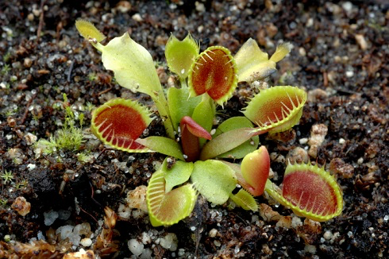
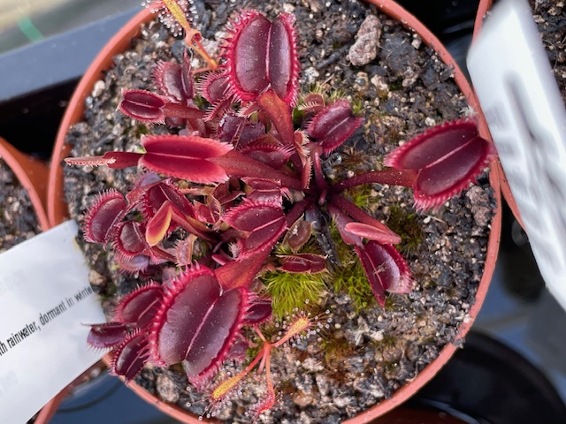
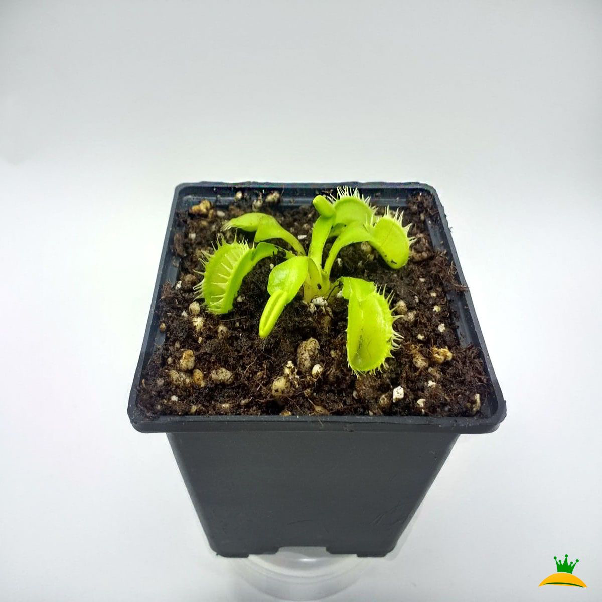

# 27th Of October 2024

I'm studying for the exams so I didn't do much today. Although I forget to say yesterday which type of venus I bought.

I bought:

Dionaea "Cupped Trap" x1 

*Dionaea "Cupped Trap".*
  

Dionaea “Amteborous” x1 

*Dionaea "Amteborous".*
  

Dionaea "Tritón" x1

*Dionaea "Tritón".*
    

They will arrive soon, so I will take pictures of them and post them here.

## Weather

Raining (85%) / Lightning day 14ºC - 22ºC

## Final Inventory

(Plants)
- Dionaea Muscipula (Microdent)
- Sarracenia Bekerplant
- Dionaea Muscipula (B52)
- Nepenthes Ventricosa X Alata x2
- Drosera Capensi Alba
- Drosera Aliciae
- Sarracenia Stenvesii x 3
- Sarracenia Stevensii Mini
- Sarracenia Tygo

(Seeds)
- Drosera ...

(Equipment)
- Full-Spectrum Light 50W

(Died)
- Drosera ...

 
 
 
 
 

**Previous page**: <a href="./26_oct_2024">26 Oct 2024</a>

**Next page**: <a href="./28_oct_2024">28 Oct 2024</a>
 
 
 
 
 
 