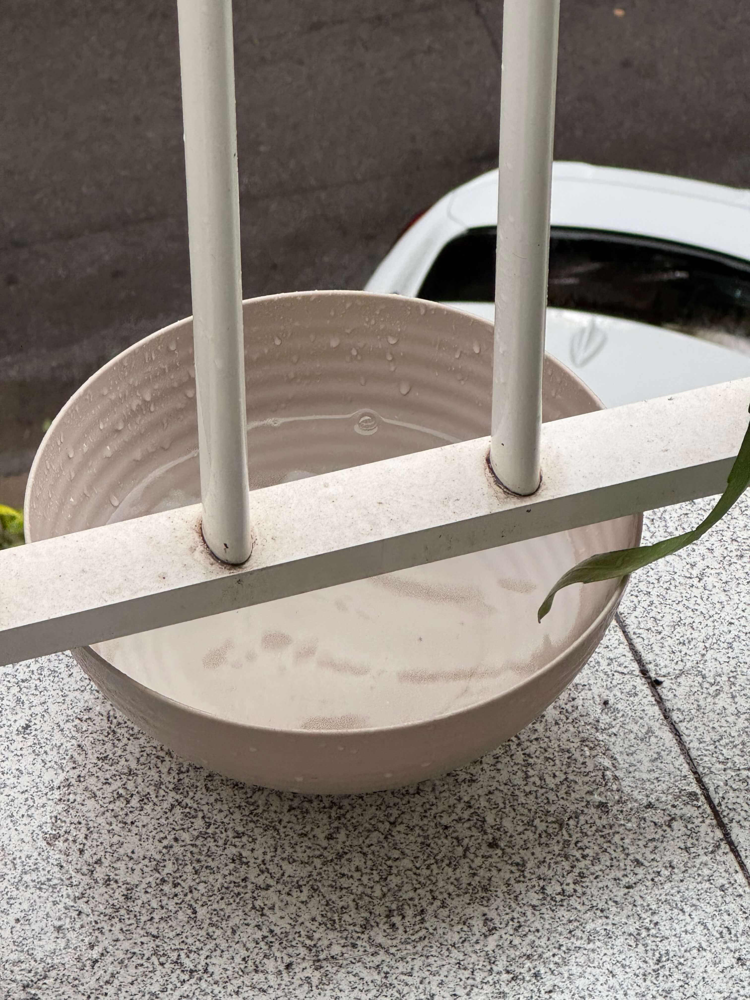
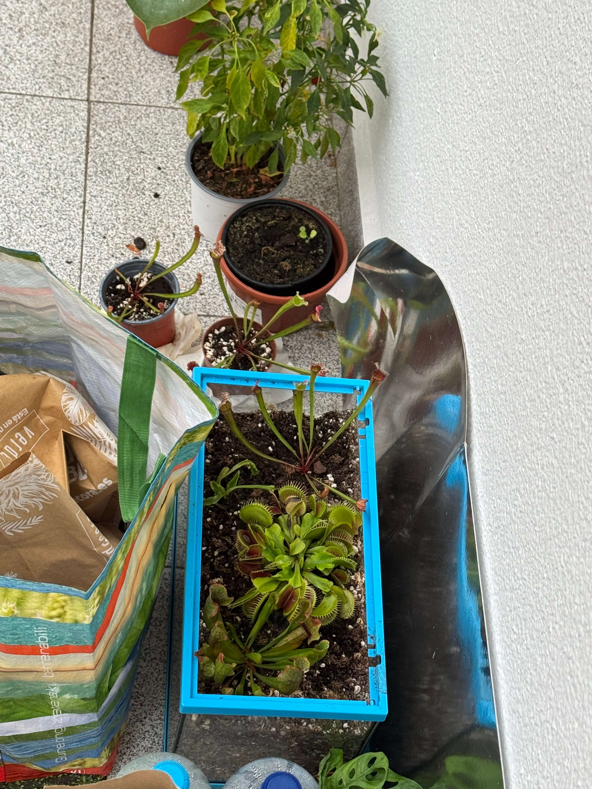
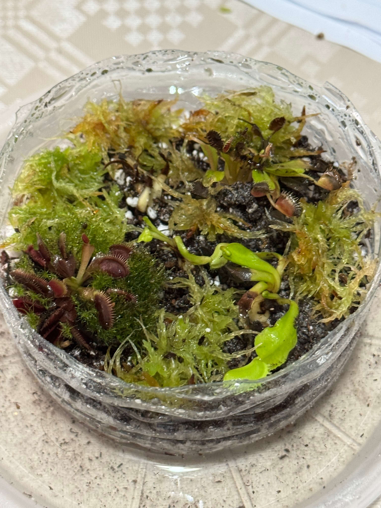
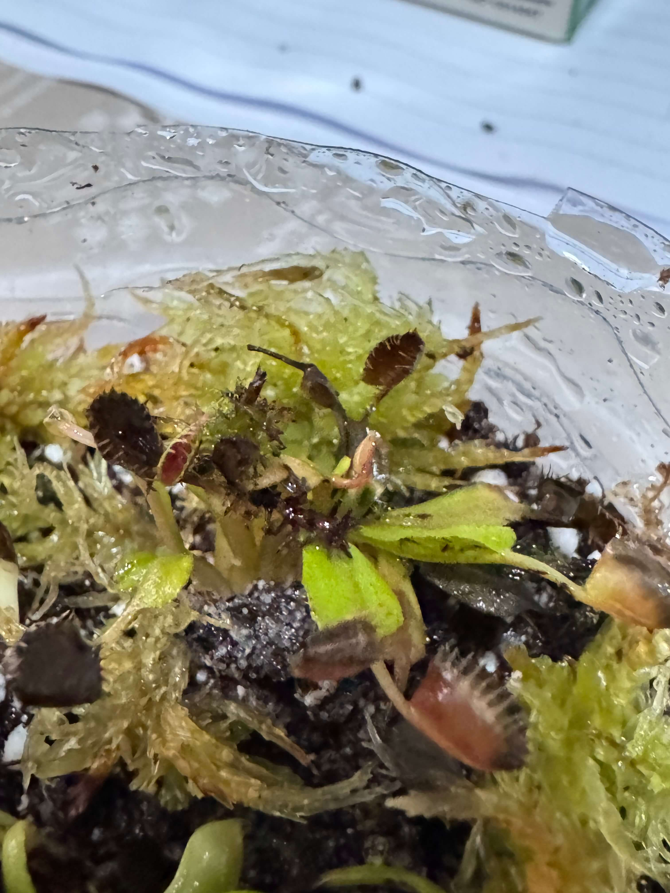
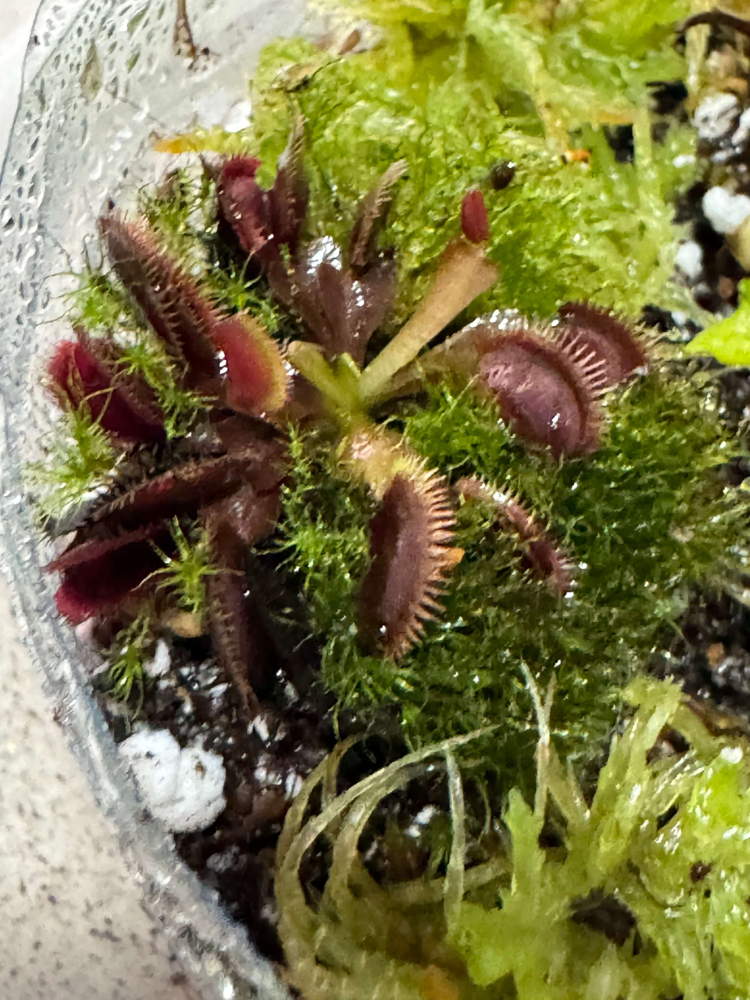
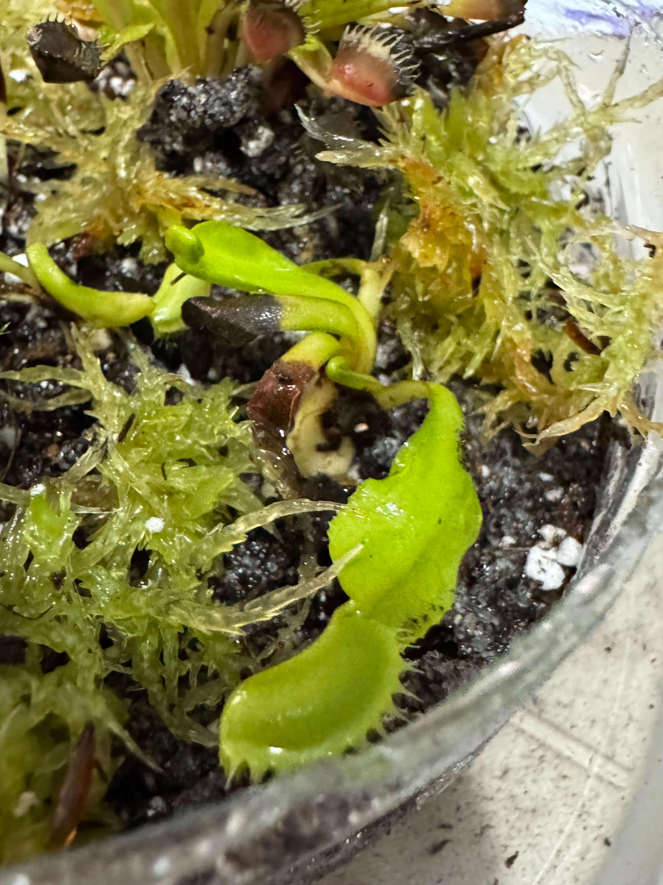
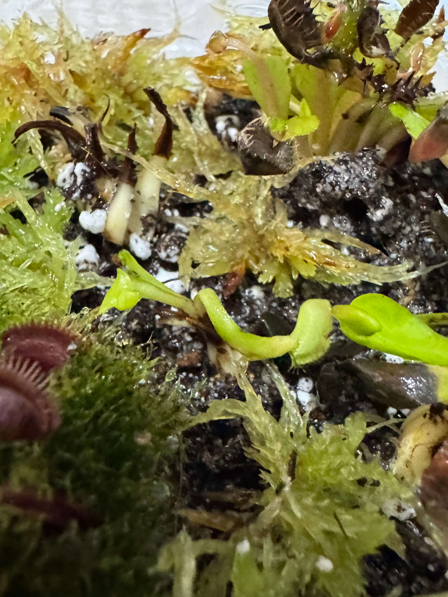

# 29th Of October 2024

Today morning rained a lot, look at my bowl.

*Bowl with water.*
  

As soon as I notice the weather alarm of Level 3 warning I went outside and checked my plants, all my plants that there are in dormancy they are outside, so I put them inside to prevent any problem. Anyways the weather was not too cold, so I put them them down the light.

*Plants outside.*
  

I'm still studying for the exams, so I didn't do much today. However, I did some light rotation. And I watered a little bit the plants that are not in dormancy.

Finally, the best. I received the venus that I bought. I bought a Dionaea "Cupped Trap", a Dionaea "Amteborous" and a Dionaea "Tritón". They are so beautiful. Sincerely I thought that they would be bigger, but don't worry, the seller gave me an extra venus, but I don't know the species. I asked him, so when he answers me I will update the inventory.
 

*New dionaea.*
  

Dionaea "Cupped Trap" x1 

*Dionaea "Cupped Trap".*
  

Dionaea “Amteborous” x1 

*Dionaea "Amteborous".*
  

Dionaea "Tritón" x1 (I splitted it in two)

*Dionaea "Tritón".*
  

Dionaea Extra x1

*Dionaea Extra.*
    

## Weather

Level 3 Warning Raining (95%) day 19ºC - 21ºC

## Final Inventory

(Plants)
- Dionaea Muscipula (Microdent)
- Sarracenia Bekerplant
- Dionaea Muscipula (B52)
- Nepenthes Ventricosa X Alata x2
- Drosera Capensi Alba
- Drosera Aliciae
- Sarracenia Stenvesii x 3
- Sarracenia Stevensii Mini
- Sarracenia Tygo
- Dionaea Muscipula (Cupped Trap)
- Dionaea Muscipula (Amteborous)
- Dionaea Muscipula (Tritón) x2
- Dionaea Muscipula (...)

(Seeds)
- Drosera ...

(Equipment)
- Full-Spectrum Light 50W

(Died)
- Drosera ...

 
 
 
 
 

**Previous page**: <a href="./28_oct_2024">28 Oct 2024</a>

**Next page**: <a href="./30_oct_2024">30 Oct 2024</a>
 
 
 
 
 
 