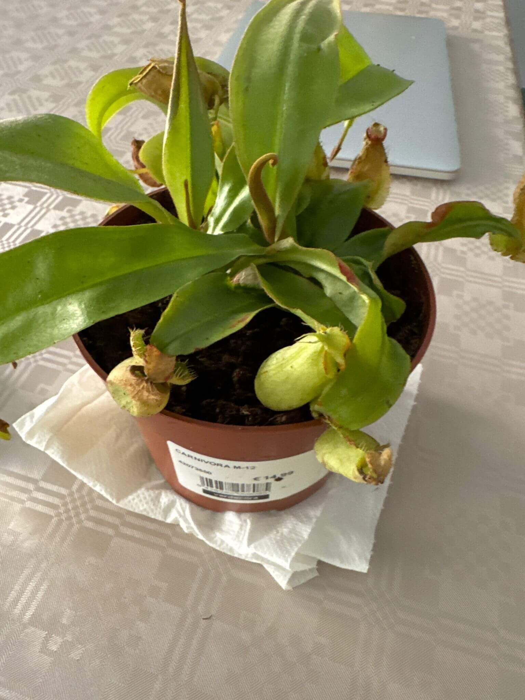

# The Savage Garden Chronicles

*Diary about my plantation of carnivorous plants.*

 
 
 
 

The diary starts with date **18th of October of 2024**, but my plants inventory started **9th of October of 2024**.

------------------------------------------

## Prologue

I bought a small Venus fly trap in a shop the 28th of August with aspiration of putting it in a terrarium, but then I realised that it was a very bad, very bad idea. First, I put some fittonias in there with the venus, and the fittonia can burn if I put them in direct sun light, then I find out that the venus was dying and growing small traps with large leaves. So since every professional gardener knows that the venus need a lot of sun light I decided to take it out and started my own plantation of different species and genus of carnivorous plants for one mission, cross pollination, to create my own species for eah genus of plants.

*My first Venus flytrap.*
    

 

*Terrarium with my Venus flytrap.*
    
 

## Initial Inventory

- Dionaea Muscipula (Microdent)

 
 
 

------------------------------------------

## Process

I asked my girlfriend if she has any free fish tank to lend me and use it as a big pot, she gave me one that she used to use it for worms. Days before I managed to get a Sarracenia Bekerplant, a Dionaea Muscipula (B52), a Nepenthes (I don't know the species and I don't have enough knowledge to identify it, but I will find the species name soon) and a Drosera (Species not idenfied).

*Sarracenia Bekerplant.*
    

*Dionaea B52, one of the largest Venus flytrap varieties.*
    

*Nepenthes, a pitcher-type carnivorous plant.*
    

*Simple setup with artificial light.*
    

I started creating my soil with Sphagnum, sand, and perlite, and started putting into the tank volcanic rocks to drain the water, also some active carbon, then I filled it with soil to the top and I transplanted all the plants inside the soil.

*Sunlight shining on my tank.*
    

The sun light can't reach at all to my flat, only from 2pm to 4pm, so only 3 hours to put my plants outside (Maybe 3h in Autumm) and winter is comming soon, before spring I need my plants to be cared properly and with enough energy to bloom the flowers, so I decided to buy an artificial Full-Spectrum Cultive light in Wallapop, I don't need a very strong one, just casual so I opted the one with that only consume 50W. My gf managed to put the lights up the tank with some DIY with the belt of her bag.

*DIY artificial light for my plants.*
    

So now and then I can put my plants to 3h (At least in autumm) with sun light and then I can move it to indoor and put it with the LED light. Hope everything will go in the correct way and I can reach my mission, specific mission not determined yet but I will decide it while I'm writing this diary.

## Final Inventory

- Dionaea Muscipula (Microdent)
- Sarracenia Bekerplant
- Dionaea Muscipula (B52)
- Nepenthes ...
- Drosera ...
- Drosera ...
- Full-Spectrum Light 50W

 
 
 

------------------------------------------

### Gratitude

Thank you to be interested to read my diary and hope you can enjoy reading my book, and the most important you have learned many new knowledge. Also, I change you to do the same as I did, not only with Carnivorous plants but also with other normal plants with beautiful flowers.

Start reading here: <a href="./2024/october/17_oct_2024.md">17 Oct 2024</a>
 
 
 
 

**Signature**: *Zheng Lin Lei*

**Date**: *18th of October of 2024*
 
 
 
 
 
 

